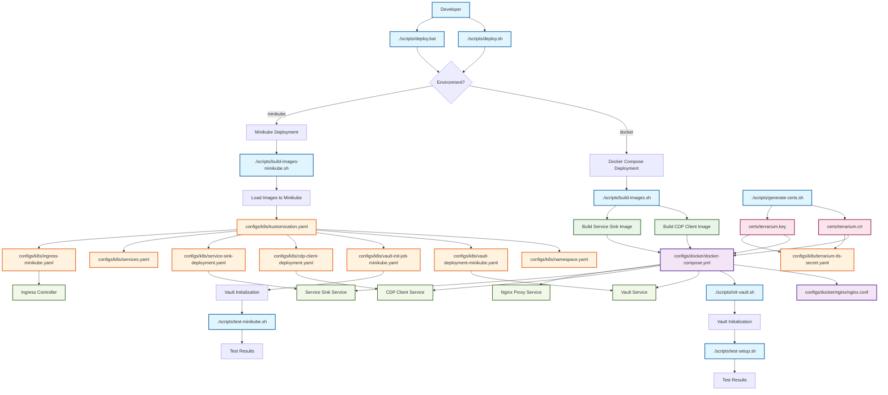

# Terrarium - Kubernetes & Docker Learning Project

A comprehensive example demonstrating Kubernetes ingress routing, Docker containerization, and C application development. This project showcases how to route HTTP requests to different services based on URL paths and ports.

## Architecture Overview

The Terrarium project consists of:

- **CDP Client Service**: Handles requests to `/fake-provider/*` and `/example-provider/*` paths, plus all traffic on port 1337
- **Service Sink**: Handles all other HTTP requests
- **HashiCorp Vault**: Secrets management for TLS certificates and application configuration
- **Nginx Reverse Proxy**: Routes requests based on URL patterns (Docker Compose setup)
- **Kubernetes Ingress**: Routes requests using NGINX Ingress Controller
- **TLS/SSL**: Self-signed certificates for secure communication

## Scripts & Configs Integration Flow

The following diagram shows how the scripts and configuration files work together to deploy and manage the Terrarium application:



### Key Integration Points

1. **Deployment Entry Points**: `deploy.sh` (Unix) and `deploy.bat` (Windows) are the main entry points
2. **Image Building**: `build-images.sh` creates Docker images used by both Docker Compose and Kubernetes
3. **Certificate Management**: `generate-certs.sh` creates TLS certificates used across all deployments
4. **Vault Initialization**: `init-vault.sh` sets up secrets for both deployment types
5. **Configuration Orchestration**: 
   - Docker Compose uses `docker-compose.yml` + `nginx.conf`
   - Kubernetes uses `kustomization.yaml` to orchestrate all K8s manifests
6. **Testing**: Separate test scripts validate each deployment type

## Project Structure

```
c-terrarium/
├── cdp-client/                 # CDP Client C application
│   ├── main.c                 # Main application source
│   └── Dockerfile             # Multi-arch Docker build
├── service-sink/              # Service Sink C application
│   ├── main.c                 # Main application source
│   └── Dockerfile             # Multi-arch Docker build
├── configs/                   # Configuration files organized by platform
│   ├── k8s/                   # Kubernetes configuration files
│   │   ├── namespace.yaml     # Terrarium namespace
│   │   ├── cdp-client-deployment.yaml
│   │   ├── service-sink-deployment.yaml
│   │   ├── vault-config.yaml  # Vault configuration
│   │   ├── vault-deployment.yaml # Vault deployment
│   │   ├── vault-service.yaml # Vault service
│   │   ├── vault-pvc.yaml     # Vault persistent volume claim
│   │   ├── vault-init-job.yaml # Vault initialization job
│   │   ├── services.yaml      # Kubernetes services
│   │   ├── ingress.yaml       # Ingress configuration
│   │   └── kustomization.yaml # Kustomize configuration
│   └── docker/                # Docker configuration files
│       ├── docker-compose.yml # Docker Compose configuration
│       └── nginx/             # Nginx configuration
│           └── nginx.conf     # Reverse proxy config
├── scripts/                   # Utility scripts
│   ├── generate-certs.sh      # TLS certificate generation
│   ├── init-vault.sh          # Vault initialization script
│   ├── build-images.sh        # Docker image build script
│   ├── deploy.sh              # Deployment script
│   ├── deploy.bat             # Windows deployment script
│   └── test-setup.sh          # Test setup script
├── certs/                     # Generated certificates (after running script)
└── README.md                  # This file
```

## Quick Decision Guide

**Choose Docker Compose if you want to**:
- Get started quickly with minimal setup
- Learn Docker concepts
- Develop and test locally
- Avoid Kubernetes complexity

**Choose Minikube if you want to**:
- Learn Kubernetes concepts
- Test production-like deployments
- Practice with ingress controllers
- Understand cluster networking

## Deployment Options

This project supports two deployment environments for different use cases:

### Docker Compose (Development)
**Best for**: Local development, quick testing, and learning Docker concepts

**Features**:
- Simple single-machine deployment
- HTTP communication between services
- Development mode Vault with HTTP
- Direct port access (443 for HTTPS)
- No Kubernetes knowledge required

**Access**: HTTPS on port 443 via nginx reverse proxy

### Minikube (Kubernetes Testing)
**Best for**: Kubernetes learning, production-like testing, and cluster validation

**Features**:
- Full Kubernetes cluster simulation
- TLS termination at ingress
- Production-like Vault setup with persistent storage
- Ingress-based routing
- Real Kubernetes networking and services

**Access**: HTTPS on port 443 via ingress with TLS certificates

## Quick Start

### Prerequisites

**For Docker Compose**:
- [Docker Desktop](https://www.docker.com/products/docker-desktop/) (Windows/Mac/Linux)

**For Minikube**:
- [Docker Desktop](https://www.docker.com/products/docker-desktop/) (Windows/Mac/Linux)
- [kubectl](https://kubernetes.io/docs/tasks/tools/) (Windows/Mac/Linux)
- [Minikube](https://minikube.sigs.k8s.io/docs/start/) (Windows/Mac/Linux)

### Cross-Platform Deployment Commands

**Windows (Command Prompt/PowerShell)**:
```cmd
# Deploy to Docker Compose
scripts\deploy.bat docker deploy

# Deploy to Minikube
scripts\deploy.bat minikube deploy

# Test deployments
scripts\deploy.bat docker test
scripts\deploy.bat minikube test

# Clean up deployments
scripts\deploy.bat docker clean
scripts\deploy.bat minikube clean

# View logs
scripts\deploy.bat docker logs
scripts\deploy.bat minikube logs
```

**Linux/macOS (Bash)**:
```bash
# Deploy to Docker Compose
./scripts/deploy.sh docker deploy

# Deploy to Minikube
./scripts/deploy.sh minikube deploy

# Test deployments
./scripts/deploy.sh docker test
./scripts/deploy.sh minikube test

# Clean up deployments
./scripts/deploy.sh docker clean
./scripts/deploy.sh minikube clean

# View logs
./scripts/deploy.sh docker logs
./scripts/deploy.sh minikube logs
```

## Manual Setup (Alternative)

If you prefer manual setup over the deployment script:

### Step 1: Generate TLS Certificates

**Windows (Command Prompt/PowerShell)**:
```cmd
# Run the certificate generation script
scripts\generate-certs.sh
```

**Linux/macOS (Bash)**:
```bash
# Make the script executable and run it
chmod +x scripts/generate-certs.sh
./scripts/generate-certs.sh
```

This creates self-signed certificates in the `certs/` directory and generates Kubernetes secrets.

**Important Security Notes:**
- The script generates actual certificate files that should **NEVER** be committed to git
- Only the `.template` files in the `certs/` directory are committed to the repository
- The generated YAML files contain real certificate data and are automatically excluded by `.gitignore`
- Run this script on each environment to generate fresh certificates

### Step 2: Build Docker Images

**Cross-Platform**:
```bash
# Build both services
docker build -t terrarium-cdp-client:latest ./cdp-client
docker build -t terrarium-service-sink:latest ./service-sink
```

### Step 3: Choose Your Deployment Method

#### Option A: Docker Compose (Recommended for Development)

**Cross-Platform**:
```bash
# Start all services
docker-compose up -d

# Check status
docker-compose ps

# View logs
docker-compose logs -f

# Test the deployment
curl -k https://localhost:443/fake-provider/test
curl -k https://localhost:443/api/test
```

#### Option B: Minikube (Recommended for Kubernetes Learning)

**Prerequisites**:
```bash
# Start Minikube
minikube start

# Enable ingress addon
minikube addons enable ingress
```

**Deploy to Minikube**:
```bash
# Apply the Kubernetes manifests
kubectl apply -k configs/k8s/

# Apply TLS secret
kubectl apply -f certs/terrarium-tls-secret.yaml

# Apply Minikube-specific configurations
kubectl apply -f configs/k8s/vault-deployment-minikube.yaml
kubectl apply -f configs/k8s/vault-init-job-minikube.yaml
kubectl apply -f configs/k8s/ingress-minikube.yaml

# Check deployments
kubectl get pods -n terrarium

# Check services
kubectl get svc -n terrarium

# Check ingress
kubectl get ingress -n terrarium
```

**Test Minikube Deployment**:
```bash
# Option 1: Use the dedicated test script
./scripts/test-minikube.sh

# Option 2: Manual testing with port forwarding
kubectl port-forward -n ingress-nginx service/ingress-nginx-controller 8443:443
curl -k -H "Host: localhost" https://localhost:8443/fake-provider/test

# Option 3: Use minikube tunnel (requires sudo on Linux/macOS)
sudo minikube tunnel
curl -k -H "Host: localhost" https://localhost/fake-provider/test
```

## Configuration

### Routing Rules

| URL Pattern | Destination | Port | Description |
|-------------|-------------|------|-------------|
| `/fake-provider/*` | CDP Client | 443 | Routes to CDP client service |
| `/example-provider/*` | CDP Client | 443 | Routes to CDP client service |
| Port 1337 | CDP Client | 1337 | All traffic on port 1337 |
| All other paths | Service Sink | 8080 | Default routing |

### Environment Variables

Both services support the following environment variables:

- `SERVICE_NAME`: Service identifier
- `LOG_LEVEL`: Logging level (info, debug, error)

### Vault Integration

The CDP Client integrates with HashiCorp Vault for secrets management:

#### Vault Configuration

- **Vault URL**: 
  - **Docker Compose**: `http://localhost:8200` (direct access)
  - **Minikube**: `http://localhost:8200` (via port forwarding)
  - **Internal Cluster**: `http://vault.terrarium.svc.cluster.local:8200` (within cluster only)
- **Authentication**: Root token (`root`) for development
- **Secrets Engine**: KV v2 at `/secret/` path

#### Stored Secrets

The following secrets are automatically stored in Vault:

**TLS Certificates** (`/secret/terrarium/tls`):
- `cert`: Base64-encoded TLS certificate
- `key`: Base64-encoded TLS private key
- `ca`: Base64-encoded CA certificate

**CDP Client Configuration** (`/secret/cdp-client/config`):
- `api_key`: API authentication key
- `database_url`: Database connection string
- `jwt_secret`: JWT signing secret
- `encryption_key`: Data encryption key
- `log_level`: Application log level
- `max_connections`: Maximum database connections

**CDP Client External APIs** (`/secret/cdp-client/external-apis`):
- `provider_auth_token`: External provider authentication token
- `webhook_secret`: Webhook validation secret
- `rate_limit`: API rate limit
- `timeout_seconds`: Request timeout

#### Vault Initialization

For Docker Compose:
```bash
# Start Vault
docker-compose up -d vault

# Initialize Vault with secrets
./scripts/init-vault.sh http://localhost:8200
```

For Minikube:
```bash
# Vault is automatically initialized by the vault-init job
kubectl get jobs -n terrarium
kubectl logs -n terrarium job/vault-init

# Access Vault UI (port forwarding is automatic after deployment)
# Open http://localhost:8200 in your browser
# Login with token: root
```

#### Vault Operations with cURL

**Adding New Secrets to Vault:**

```bash
# Set Vault environment variables
export VAULT_ADDR="http://localhost:8200"   # For both Docker Compose and Minikube
export VAULT_TOKEN="root"

# Add a new secret to the CDP client configuration
curl -X POST \
  -H "X-Vault-Token: $VAULT_TOKEN" \
  -H "Content-Type: application/json" \
  -d '{
    "data": {
      "new_secret_key": "new_secret_value",
      "another_key": "another_value"
    }
  }' \
  "$VAULT_ADDR/v1/secret/data/cdp-client/config"

# Add a completely new secret path
curl -X POST \
  -H "X-Vault-Token: $VAULT_TOKEN" \
  -H "Content-Type: application/json" \
  -d '{
    "data": {
      "database_password": "super_secure_password_123",
      "api_endpoint": "https://api.example.com/v1"
    }
  }' \
  "$VAULT_ADDR/v1/secret/data/cdp-client/database"
```

**Reading Secrets from Vault:**

```bash
# Read all secrets from a path
curl -H "X-Vault-Token: $VAULT_TOKEN" \
  "$VAULT_ADDR/v1/secret/data/cdp-client/config" | jq .

# Read a specific secret (returns all data, you need to extract the specific key)
curl -H "X-Vault-Token: $VAULT_TOKEN" \
  "$VAULT_ADDR/v1/secret/data/cdp-client/config" | jq '.data.data.api_key'

# List all secret paths
curl -H "X-Vault-Token: $VAULT_TOKEN" \
  "$VAULT_ADDR/v1/secret/metadata?list=true" | jq .

# Read TLS certificates
curl -H "X-Vault-Token: $VAULT_TOKEN" \
  "$VAULT_ADDR/v1/secret/data/terrarium/tls" | jq '.data.data.cert' | base64 -d
```

**Updating Existing Secrets:**

```bash
# Update an existing secret (this will merge with existing data)
curl -X POST \
  -H "X-Vault-Token: $VAULT_TOKEN" \
  -H "Content-Type: application/json" \
  -d '{
    "data": {
      "api_key": "updated_api_key_value",
      "log_level": "DEBUG"
    }
  }' \
  "$VAULT_ADDR/v1/secret/data/cdp-client/config"
```

**Deleting Secrets:**

```bash
# Delete a specific secret path
curl -X DELETE \
  -H "X-Vault-Token: $VAULT_TOKEN" \
  "$VAULT_ADDR/v1/secret/data/cdp-client/old-config"

# Delete a specific version of a secret (if versioning is enabled)
curl -X DELETE \
  -H "X-Vault-Token: $VAULT_TOKEN" \
  "$VAULT_ADDR/v1/secret/data/cdp-client/config?versions=1"
```

**Vault Health and Status:**

```bash
# Check Vault health
curl "$VAULT_ADDR/v1/sys/health" | jq .

# Check Vault status
curl -H "X-Vault-Token: $VAULT_TOKEN" \
  "$VAULT_ADDR/v1/sys/status" | jq .

# List all mounted secret engines
curl -H "X-Vault-Token: $VAULT_TOKEN" \
  "$VAULT_ADDR/v1/sys/mounts" | jq .
```

## Testing

### Automated Testing

**Windows (Command Prompt/PowerShell)**:
```cmd
# Test Docker Compose deployment
scripts\test-setup.sh

# Test Minikube deployment
scripts\test-minikube.sh
```

**Linux/macOS (Bash)**:
```bash
# Test Docker Compose deployment
./scripts/test-setup.sh

# Test Minikube deployment
./scripts/test-minikube.sh
```

### Manual Testing

#### Docker Compose Testing

**Cross-Platform**:
```bash
# Test CDP Client routes
curl -k https://localhost:443/fake-provider/test
curl -k https://localhost:443/example-provider/test

# Test Service Sink (default route)
curl -k https://localhost:443/api/test
curl -k https://localhost:443/health

# Test port 1337 (direct to CDP Client)
curl -k https://localhost:443/test
```

**Windows PowerShell Alternative**:
```powershell
# Test CDP Client routes
Invoke-WebRequest -Uri "https://localhost:443/fake-provider/test" -SkipCertificateCheck
Invoke-WebRequest -Uri "https://localhost:443/example-provider/test" -SkipCertificateCheck

# Test Service Sink (default route)
Invoke-WebRequest -Uri "https://localhost:443/api/test" -SkipCertificateCheck
Invoke-WebRequest -Uri "https://localhost:443/health" -SkipCertificateCheck
```

#### Minikube Testing

**Option 1: Port Forwarding (Recommended)**
```bash
# Set up port forwarding
kubectl port-forward -n ingress-nginx service/ingress-nginx-controller 8443:443

# Test routes (in another terminal)
curl -k -H "Host: localhost" https://localhost:8443/fake-provider/test
curl -k -H "Host: localhost" https://localhost:8443/example-provider/test
curl -k -H "Host: localhost" https://localhost:8443/api/test
```

**Option 2: Minikube Tunnel (Linux/macOS only)**
```bash
# Start tunnel (requires sudo)
sudo minikube tunnel

# Test routes (in another terminal)
curl -k -H "Host: localhost" https://localhost/fake-provider/test
curl -k -H "Host: localhost" https://localhost/example-provider/test
curl -k -H "Host: localhost" https://localhost/api/test
```

**Option 3: Direct IP Access (Advanced)**
```bash
# Get Minikube IP
minikube ip

# Add to hosts file (Linux/macOS)
echo "$(minikube ip) terrarium.local" | sudo tee -a /etc/hosts

# Windows: Add to C:\Windows\System32\drivers\etc\hosts
# <minikube-ip> terrarium.local

# Test routes
curl -k https://terrarium.local/fake-provider/test
curl -k https://terrarium.local/example-provider/test
curl -k https://terrarium.local/api/test
```

## Monitoring & Debugging

### View Request Logs

CDP Client writes request details to `/tmp/requests/` directory:

**Cross-Platform**:
```bash
# Docker Compose
docker exec terrarium-cdp-client ls -la /tmp/requests/

# Kubernetes
kubectl exec -n terrarium deployment/cdp-client -- ls -la /tmp/requests/
```

### Check Service Health

**Cross-Platform**:
```bash
# Docker Compose
docker-compose ps

# Kubernetes
kubectl get pods -n terrarium
kubectl describe pod <pod-name> -n terrarium
```

### View Application Logs

**Cross-Platform**:
```bash
# Docker Compose
docker-compose logs cdp-client
docker-compose logs service-sink
docker-compose logs vault

# Kubernetes
kubectl logs -n terrarium deployment/cdp-client
kubectl logs -n terrarium deployment/service-sink
kubectl logs -n terrarium deployment/vault
```

### Troubleshooting Common Issues

#### Docker Compose Issues

**Port 443 Permission Denied (Linux/macOS)**:
```bash
# Run with sudo or use a different port
sudo docker-compose up -d
# OR modify docker-compose.yml to use port 8443 instead of 443
```

**Windows Docker Desktop Issues**:
```powershell
# Ensure Docker Desktop is running
# Check if WSL2 backend is enabled
# Restart Docker Desktop if needed
```

#### Minikube Issues

**Ingress Not Accessible**:
```bash
# Check if ingress controller is running
kubectl get pods -n ingress-nginx

# Check ingress status
kubectl get ingress -n terrarium

# Use port forwarding as alternative
kubectl port-forward -n ingress-nginx service/ingress-nginx-controller 8443:443
```

**Pod Stuck in Pending State**:
```bash
# Check pod events
kubectl describe pod <pod-name> -n terrarium

# Check PVC status
kubectl get pvc -n terrarium

# Check storage class
kubectl get storageclass
```

**Vault Initialization Issues**:
```bash
# Check vault-init job logs
kubectl logs -n terrarium job/vault-init

# Check vault pod logs
kubectl logs -n terrarium deployment/vault

# Restart vault-init job
kubectl delete job vault-init -n terrarium
kubectl apply -f configs/k8s/vault-init-job-minikube.yaml
```

## Security Considerations

- Self-signed certificates are used for development only
- Services run as non-root users in containers
- Security headers are configured in Nginx
- TLS 1.2+ is enforced
- Request body size is limited to 5MB

## Learning Resources

### Kubernetes Documentation
- [Kubernetes Concepts](https://kubernetes.io/docs/concepts/)
- [Ingress Controllers](https://kubernetes.io/docs/concepts/services-networking/ingress-controllers/)
- [Services and Networking](https://kubernetes.io/docs/concepts/services-networking/)
- [Deployments](https://kubernetes.io/docs/concepts/workloads/controllers/deployment/)
- [ConfigMaps and Secrets](https://kubernetes.io/docs/concepts/configuration/)

### Docker Documentation
- [Docker Compose](https://docs.docker.com/compose/)
- [Dockerfile Best Practices](https://docs.docker.com/develop/dev-best-practices/dockerfile_best-practices/)
- [Multi-stage Builds](https://docs.docker.com/develop/dev-best-practices/dockerfile_best-practices/#use-multi-stage-builds)
- [Container Networking](https://docs.docker.com/network/)

### NGINX Documentation
- [NGINX Ingress Controller](https://kubernetes.github.io/ingress-nginx/)
- [NGINX Configuration](https://nginx.org/en/docs/)
- [SSL/TLS Configuration](https://nginx.org/en/docs/http/configuring_https_servers.html)

## Development

### Building from Source

```bash
# Compile CDP Client
gcc -o cdp-client cdp-client/main.c

# Compile Service Sink
gcc -o service-sink service-sink/main.c
```

### Customizing the Applications

Both C applications are designed to be simple but functional:

- **CDP Client**: Parses HTTP requests, logs them to files, and responds with JSON
- **Service Sink**: Processes requests and returns response with path analysis

You can modify the applications to add more functionality while maintaining the basic request/response pattern.
