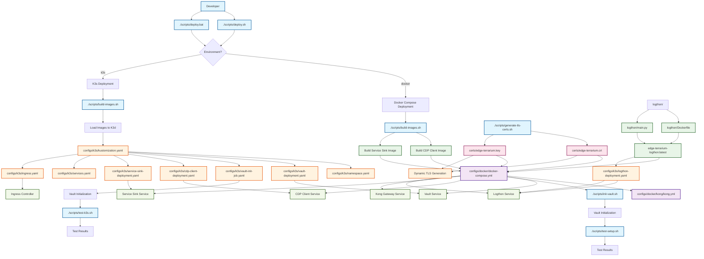

# Edge-Terrarium - Kubernetes & Docker Learning Project

A comprehensive example demonstrating Kubernetes ingress routing, Docker containerization, and C application development. This project showcases how to route HTTP requests to different services based on URL paths and ports.

## Architecture Overview

The Edge-Terrarium project consists of:

- **CDP Client Service**: Handles requests to `/fake-provider/*` and `/example-provider/*` paths, plus all traffic on port 1337
- **Service Sink**: Handles all other HTTP requests
- **Logthon Service**: Python-based log aggregation service that collects and displays logs from all services
- **HashiCorp Vault**: Secrets management for TLS certificates and application configuration
- **Kong Gateway**: Routes requests based on URL patterns (both Docker Compose and K3s)
- **Kubernetes Ingress**: Routes requests using Kong Ingress Controller
- **TLS/SSL**: Dynamically generated self-signed certificates for secure communication

## Scripts & Configs Integration Flow

The following diagram shows how the scripts and configuration files work together to deploy and manage the Edge-Terrarium application:



### Key Integration Points

1. **Deployment Entry Points**: `deploy.sh` (Unix) and `deploy.bat` (Windows) are the main entry points
2. **Image Building**: `build-images.sh` creates Docker images used by both Docker Compose and Kubernetes
3. **Certificate Management**: `generate-tls-certs.sh` creates TLS certificates used across all deployments
4. **Vault Initialization**: `init-vault.sh` sets up secrets for both deployment types
5. **Configuration Orchestration**: 
   - Docker Compose uses `docker-compose.yml` + `kong/kong.yml`
   - Kubernetes uses `kustomization.yaml` to orchestrate all K8s manifests
6. **Testing**: Separate test scripts validate each deployment type

## Project Structure

```
c-edge-terrarium/
├── cdp-client/                 # CDP Client C application
│   ├── main.c                 # Main application source
│   └── Dockerfile             # Multi-arch Docker build
├── service-sink/              # Service Sink C application
│   ├── main.c                 # Main application source
│   └── Dockerfile             # Multi-arch Docker build
├── logthon/                   # Logthon Python log aggregation service
│   ├── main.py                # FastAPI application source
│   ├── Dockerfile             # Python Docker build
│   ├── pyproject.toml         # Python project configuration
│   └── README.md              # Logthon service documentation
├── configs/                   # Configuration files organized by platform
│   ├── k3s/                   # Kubernetes configuration files for K3s
│   │   ├── namespace.yaml     # Edge-Terrarium namespace
│   │   ├── cdp-client-deployment.yaml
│   │   ├── service-sink-deployment.yaml
│   │   ├── logthon-deployment.yaml # Logthon deployment
│   │   ├── logthon-service.yaml # Logthon service
│   │   ├── logthon-ingress-service.yaml # Logthon ingress service
│   │   ├── vault-config.yaml  # Vault configuration
│   │   ├── vault-deployment.yaml # Vault deployment
│   │   ├── vault-service.yaml # Vault service
│   │   ├── vault-pvc.yaml     # Vault persistent volume claim
│   │   ├── vault-init-job.yaml # Vault initialization job
│   │   ├── services.yaml      # Kubernetes services
│   │   ├── ingress.yaml       # Ingress configuration
│   │   └── kustomization.yaml # Kustomize configuration
│   └── docker/                # Docker configuration files
│       ├── docker-compose.yml # Docker Compose configuration
│       └── kong/              # Kong Gateway configuration
│           └── kong.yml       # API Gateway config
├── scripts/                   # Utility scripts
│   ├── generate-tls-certs.sh  # TLS certificate generation
│   ├── create-k3s-tls-secret.sh # K3s TLS secret creation
│   ├── init-vault.sh          # Vault initialization script
│   ├── build-images.sh        # Docker image build script
│   ├── build-images-k3s.sh    # K3s-specific image build script
│   ├── deploy.sh              # Deployment script
│   ├── deploy.bat             # Windows deployment script
│   ├── test-setup.sh          # Test setup script
│   └── test-k3s.sh            # K3s test script
├── certs/                     # Generated certificates (after running script)
└── README.md                  # This file
```

## Quick Decision Guide

**Choose Docker Compose if you want to**:
- Get started quickly with minimal setup
- Learn Docker concepts
- Develop and test locally
- Avoid Kubernetes complexity

**Choose K3s if you want to**:
- Learn Kubernetes concepts
- Test production-like deployments
- Practice with ingress controllers
- Understand cluster networking

## Deployment Options

This project supports two deployment environments for different use cases:

### Docker Compose (Development)
**Best for**: Local development, quick testing, and learning Docker concepts

**Features**:
- Simple single-machine deployment
- HTTP communication between services
- Development mode Vault with HTTP
- Direct port access (8443 for HTTPS, 5001 for Logthon)
- No Kubernetes knowledge required
- Kong Gateway for request routing
- Logthon log aggregation service

**Access**: HTTPS on port 8443 via Kong Gateway, Logthon on port 5001

### K3s (Kubernetes Testing)
**Best for**: Kubernetes learning, production-like testing, and cluster validation

**Features**:
- Full Kubernetes cluster simulation
- TLS termination at ingress
- Production-like Vault setup with persistent storage
- Ingress-based routing with Kong
- Real Kubernetes networking and services
- Logthon log aggregation service
- Kong Ingress Controller

**Access**: HTTPS on port 443 via Kong ingress, Logthon on port 5001 via LoadBalancer

## Quick Start

### Prerequisites

**For Docker Compose**:
- [Docker Desktop](https://www.docker.com/products/docker-desktop/) (Windows/Mac/Linux)
- Supports both AMD64 and ARM64 architectures

**For K3s**:
- [Docker Desktop](https://www.docker.com/products/docker-desktop/) (Windows/Mac/Linux)
- [kubectl](https://kubernetes.io/docs/tasks/tools/) (Windows/Mac/Linux)
- [k3d](https://k3d.io/) (K3s in Docker)
- Supports both AMD64 and ARM64 architectures (auto-detected)

### Platform Compatibility

This project automatically detects your host architecture and builds appropriate Docker images:

- **AMD64 (x86_64)**: Intel/AMD processors on Windows, Mac, and Linux
- **ARM64 (aarch64)**: Apple Silicon Macs, ARM-based Linux systems

The build scripts will automatically:
- Detect your host architecture using `uname -m`
- Build Docker images for the appropriate platform
- Ensure compatibility with your k3d cluster architecture

### Cross-Platform Deployment Commands

**Windows (Command Prompt/PowerShell)**:
```cmd
# Deploy to Docker Compose
scripts\deploy.bat docker deploy

# Deploy to K3s
scripts\deploy.bat k3s deploy

# Test deployments
scripts\deploy.bat docker test
scripts\deploy.bat k3s test

# Clean up deployments
scripts\deploy.bat docker clean
scripts\deploy.bat k3s clean

# View logs
scripts\deploy.bat docker logs
scripts\deploy.bat k3s logs
```

**Linux/macOS (Bash)**:
```bash
# Deploy to Docker Compose
./scripts/deploy.sh docker deploy

# Deploy to K3s
./scripts/deploy.sh k3s deploy

# Test deployments
./scripts/deploy.sh docker test
./scripts/deploy.sh k3s test

# Clean up deployments
./scripts/deploy.sh docker clean
./scripts/deploy.sh k3s clean

# View logs
./scripts/deploy.sh docker logs
./scripts/deploy.sh k3s logs
```

## Manual Setup (Alternative)

If you prefer manual setup over the deployment script:

### Step 1: Generate TLS Certificates

**Windows (Command Prompt/PowerShell)**:
```cmd
# Run the certificate generation script
scripts\generate-tls-certs.sh
```

**Linux/macOS (Bash)**:
```bash
# Make the script executable and run it
chmod +x scripts/generate-tls-certs.sh
./scripts/generate-tls-certs.sh
```

This creates self-signed certificates in the `certs/` directory and generates Kubernetes secrets.

**Important Security Notes:**
- The script generates actual certificate files that should **NEVER** be committed to git
- Only the `.template` files in the `certs/` directory are committed to the repository
- The generated YAML files contain real certificate data and are automatically excluded by `.gitignore`
- Run this script on each environment to generate fresh certificates

### Step 2: Build Docker Images

**Cross-Platform**:
```bash
# Build all services
docker build -t edge-terrarium-cdp-client:latest ./cdp-client
docker build -t edge-terrarium-service-sink:latest ./service-sink
docker build -t edge-terrarium-logthon:latest ./logthon
```

### Step 3: Choose Your Deployment Method

#### Option A: Docker Compose (Recommended for Development)

**Cross-Platform**:
```bash
# Start all services
docker-compose up -d

# Check status
docker-compose ps

# View logs
docker-compose logs -f

# Test the deployment
curl -k https://localhost:8443/fake-provider/test
curl -k https://localhost:8443/api/test

# Test Logthon log aggregation service
curl http://localhost:5001/health
curl http://localhost:5001/
```

#### Option B: K3s with k3d (Recommended for Kubernetes Learning)

**Prerequisites**:
```bash
# Install k3d (K3s in Docker)
# macOS: brew install k3d
# Linux: curl -s https://raw.githubusercontent.com/k3d-io/k3d/main/install.sh | bash
# Windows: Use WSL or install via chocolatey

# Create K3s cluster with port mappings
k3d cluster create edge-terrarium --port "80:80@loadbalancer" --port "443:443@loadbalancer" --port "8200:8200@loadbalancer" --port "5001:5001@loadbalancer"

# Note: K3s comes with Traefik by default, but we use Kong ingress controller
# The cluster will automatically match your host architecture (AMD64/ARM64)
```

**Deploy to K3s**:
```bash
# Apply the Kubernetes manifests
kubectl apply -k configs/k3s/

# Apply TLS secret
# TLS certificates are now generated dynamically during deployment

# Check deployments
kubectl get pods -n edge-terrarium

# Check services
kubectl get svc -n edge-terrarium

# Check ingress
kubectl get ingress -n edge-terrarium
```

**Note**: The K3s deployment is configured with single replicas for development purposes. In production, you would typically increase the replica count for high availability.

**Test K3s Deployment**:
```bash
# Option 1: Use the dedicated test script
./scripts/test-k3s.sh

# Option 2: Direct access via k3d load balancer (recommended)
curl -k -H "Host: localhost" https://localhost:443/fake-provider/test

# Option 3: Manual testing with port forwarding (if needed)
kubectl port-forward -n default service/kong-kong-proxy 8443:443
curl -k -H "Host: localhost" https://localhost:8443/fake-provider/test

# Access Vault directly (requires port forwarding)
kubectl port-forward -n edge-terrarium service/vault 8200:8200
curl -k http://localhost:8200/v1/sys/health

# Test Logthon log aggregation service
curl http://localhost:5001/health
curl http://localhost:5001/
```

### K3d Container Architecture

When you deploy to K3s using k3d, you'll see several Docker containers running that make up the Kubernetes cluster and your application:

#### K3d Cluster Containers
These containers are created and managed by k3d to provide the Kubernetes cluster infrastructure:

- **`k3d-edge-terrarium-server-0`**: The main Kubernetes control plane node
  - Runs the Kubernetes API server, etcd, scheduler, and controller manager
  - Handles cluster management and orchestration
  - Exposes the Kubernetes API on port 6443

- **`k3d-edge-terrarium-agent-0`**: The Kubernetes worker node
  - Runs the kubelet and kube-proxy
  - Executes your application pods
  - Handles container runtime operations

- **`k3d-edge-terrarium-serverlb`**: The load balancer
  - Routes traffic to the appropriate nodes
  - Handles port forwarding from host to cluster
  - Manages the external access points (ports 80, 443, 8200, 5001)

#### Application Containers
These containers run your actual application services within the Kubernetes cluster:

- **`edge-terrarium-cdp-client-*`**: CDP Client service pods
  - Handles requests to `/fake-provider/*` and `/example-provider/*` paths
  - Written in C, processes HTTP requests and writes them to files
  - Retrieves secrets from Vault for configuration

- **`edge-terrarium-service-sink-*`**: Service Sink pods
  - Handles all other HTTP requests (default route)
  - Also written in C, provides basic request processing
  - Simulates other services in the system

- **`edge-terrarium-logthon-*`**: Logthon log aggregation pods
  - Python-based service that collects logs from all other services
  - Provides web UI for real-time log viewing
  - Exposes log aggregation API endpoints

- **`edge-terrarium-vault-*`**: HashiCorp Vault pods
  - Manages secrets and configuration data
  - Stores TLS certificates and application secrets
  - Provides secure secret retrieval for other services

- **`kong-*`**: Kong Gateway pods
  - API gateway and reverse proxy
  - Routes requests based on URL patterns
  - Handles TLS/SSL termination
  - Manages ingress traffic into the cluster

#### Container Management
```bash
# View all k3d containers
docker ps --filter "name=k3d-edge-terrarium"

# View only application containers
docker ps --filter "name=edge-terrarium"

# View cluster infrastructure containers
docker ps --filter "name=k3d-edge-terrarium" --filter "name=server\|agent\|serverlb"

# View container logs
docker logs k3d-edge-terrarium-server-0
docker logs k3d-edge-terrarium-agent-0
```

**Viewing Container Logs in K3s**:
```bash
# View logs for all deployments
kubectl logs -n edge-terrarium deployment/vault -f
kubectl logs -n edge-terrarium deployment/cdp-client -f
kubectl logs -n edge-terrarium deployment/service-sink -f
kubectl logs -n edge-terrarium deployment/logthon -f

# View logs for specific pods
kubectl logs -n edge-terrarium <pod-name> -f

# View logs with timestamps and tail
kubectl logs -n edge-terrarium deployment/vault --timestamps --tail=50

# View logs from all containers in a pod
kubectl logs -n edge-terrarium <pod-name> --all-containers=true

# View logs with time filtering
kubectl logs -n edge-terrarium deployment/vault --since=1h

# View logs from multiple pods with labels
kubectl logs -n edge-terrarium -l project=edge-terrarium -f

# View Kong ingress controller logs
kubectl logs -n default deployment/kong-kong -f
```

## Configuration

### Routing Rules

| URL Pattern | Destination | Port | Description |
|-------------|-------------|------|-------------|
| `/fake-provider/*` | CDP Client | 443 | Routes to CDP client service |
| `/example-provider/*` | CDP Client | 443 | Routes to CDP client service |
| Port 1337 | CDP Client | 1337 | All traffic on port 1337 |
| All other paths | Service Sink | 8080 | Default routing |

### Environment Variables

Both services support the following environment variables:

- `SERVICE_NAME`: Service identifier
- `LOG_LEVEL`: Logging level (info, debug, error)
- `LOGTHON_HOST`: Logthon service hostname for log aggregation (K3s only)
- `LOGTHON_PORT`: Logthon service port for log aggregation (K3s only)

### Vault Integration

The CDP Client integrates with HashiCorp Vault for secrets management:

#### Vault Configuration

- **Vault URL**: 
  - **Docker Compose**: `http://localhost:8200` (direct access)
  - **K3s**: `http://localhost:8200` (via port forwarding)
  - **Internal Cluster**: `http://vault.edge-terrarium.svc.cluster.local:8200` (within cluster only)
- **Authentication**: Root token (`root`) for development
- **Secrets Engine**: KV v2 at `/secret/` path

#### Stored Secrets

The following secrets are automatically stored in Vault:

**TLS Certificates** (`/secret/terrarium/tls`):
- `cert`: Base64-encoded TLS certificate
- `key`: Base64-encoded TLS private key
- `ca`: Base64-encoded CA certificate

**CDP Client Configuration** (`/secret/cdp-client/config`):
- `api_key`: API authentication key
- `database_url`: Database connection string
- `jwt_secret`: JWT signing secret
- `encryption_key`: Data encryption key
- `log_level`: Application log level
- `max_connections`: Maximum database connections

**CDP Client External APIs** (`/secret/cdp-client/external-apis`):
- `provider_auth_token`: External provider authentication token
- `webhook_secret`: Webhook validation secret
- `rate_limit`: API rate limit
- `timeout_seconds`: Request timeout

#### Vault Initialization

For Docker Compose:
```bash
# Start Vault
docker-compose up -d vault

# Initialize Vault with secrets
./scripts/init-vault.sh http://localhost:8200
```

For K3s:
```bash
# Vault is automatically initialized by the vault-init job
kubectl get jobs -n edge-terrarium
kubectl logs -n edge-terrarium job/vault-init

# Access Vault UI (port forwarding is automatic after deployment)
# Open http://localhost:8200 in your browser
# Login with token: root
```

#### Vault Operations with cURL

**Adding New Secrets to Vault:**

```bash
# Set Vault environment variables
export VAULT_ADDR="http://localhost:8200"   # For both Docker Compose and K3s
export VAULT_TOKEN="root"

# Add a new secret to the CDP client configuration
curl -X POST \
  -H "X-Vault-Token: $VAULT_TOKEN" \
  -H "Content-Type: application/json" \
  -d '{
    "data": {
      "new_secret_key": "new_secret_value",
      "another_key": "another_value"
    }
  }' \
  "$VAULT_ADDR/v1/secret/data/cdp-client/config"

# Add a completely new secret path
curl -X POST \
  -H "X-Vault-Token: $VAULT_TOKEN" \
  -H "Content-Type: application/json" \
  -d '{
    "data": {
      "database_password": "super_secure_password_123",
      "api_endpoint": "https://api.example.com/v1"
    }
  }' \
  "$VAULT_ADDR/v1/secret/data/cdp-client/database"
```

**Reading Secrets from Vault:**

```bash
# Read all secrets from a path
curl -H "X-Vault-Token: $VAULT_TOKEN" \
  "$VAULT_ADDR/v1/secret/data/cdp-client/config" | jq .

# Read a specific secret (returns all data, you need to extract the specific key)
curl -H "X-Vault-Token: $VAULT_TOKEN" \
  "$VAULT_ADDR/v1/secret/data/cdp-client/config" | jq '.data.data.api_key'

# List all secret paths
curl -H "X-Vault-Token: $VAULT_TOKEN" \
  "$VAULT_ADDR/v1/secret/metadata?list=true" | jq .

# Read TLS certificates
curl -H "X-Vault-Token: $VAULT_TOKEN" \
  "$VAULT_ADDR/v1/secret/data/terrarium/tls" | jq '.data.data.cert' | base64 -d
```

**Updating Existing Secrets:**

```bash
# Update an existing secret (this will merge with existing data)
curl -X POST \
  -H "X-Vault-Token: $VAULT_TOKEN" \
  -H "Content-Type: application/json" \
  -d '{
    "data": {
      "api_key": "updated_api_key_value",
      "log_level": "DEBUG"
    }
  }' \
  "$VAULT_ADDR/v1/secret/data/cdp-client/config"
```

**Deleting Secrets:**

```bash
# Delete a specific secret path
curl -X DELETE \
  -H "X-Vault-Token: $VAULT_TOKEN" \
  "$VAULT_ADDR/v1/secret/data/cdp-client/old-config"

# Delete a specific version of a secret (if versioning is enabled)
curl -X DELETE \
  -H "X-Vault-Token: $VAULT_TOKEN" \
  "$VAULT_ADDR/v1/secret/data/cdp-client/config?versions=1"
```

**Vault Health and Status:**

```bash
# Check Vault health
curl "$VAULT_ADDR/v1/sys/health" | jq .

# Check Vault status
curl -H "X-Vault-Token: $VAULT_TOKEN" \
  "$VAULT_ADDR/v1/sys/status" | jq .

# List all mounted secret engines
curl -H "X-Vault-Token: $VAULT_TOKEN" \
  "$VAULT_ADDR/v1/sys/mounts" | jq .
```

## Testing

### Automated Testing

**Windows (Command Prompt/PowerShell)**:
```cmd
# Test Docker Compose deployment
scripts\test-setup.sh

# Test K3s deployment
scripts\test-k3s.sh
```

**Linux/macOS (Bash)**:
```bash
# Test Docker Compose deployment
./scripts/test-setup.sh

# Test K3s deployment
./scripts/test-k3s.sh
```

### Manual Testing

#### Docker Compose Testing

**Cross-Platform**:
```bash
# Test CDP Client routes
curl -k https://localhost:8443/fake-provider/test
curl -k https://localhost:8443/example-provider/test

# Test Service Sink (default route)
curl -k https://localhost:8443/api/test
curl -k https://localhost:8443/health

# Test port 1337 (direct to CDP Client)
curl -k https://localhost:8443/test

# Test Logthon log aggregation service
curl http://localhost:5001/health
curl http://localhost:5001/
```

**Windows PowerShell Alternative**:
```powershell
# Test CDP Client routes
Invoke-WebRequest -Uri "https://localhost:8443/fake-provider/test" -SkipCertificateCheck
Invoke-WebRequest -Uri "https://localhost:8443/example-provider/test" -SkipCertificateCheck

# Test Service Sink (default route)
Invoke-WebRequest -Uri "https://localhost:8443/api/test" -SkipCertificateCheck
Invoke-WebRequest -Uri "https://localhost:8443/health" -SkipCertificateCheck

# Test Logthon log aggregation service
Invoke-WebRequest -Uri "http://localhost:5001/health"
Invoke-WebRequest -Uri "http://localhost:5001/"
```

#### K3s Testing

**Option 1: Port Forwarding (Recommended)**
```bash
# Set up port forwarding
kubectl port-forward -n default service/kong-kong-proxy 8443:443

# Test routes (in another terminal)
curl -k -H "Host: localhost" https://localhost:8443/fake-provider/test
curl -k -H "Host: localhost" https://localhost:8443/example-provider/test
curl -k -H "Host: localhost" https://localhost:8443/api/test

# Test Logthon log aggregation service
curl http://localhost:5001/health
curl http://localhost:5001/
```

**Option 2: k3d Load Balancer (Recommended)**
```bash
# k3d automatically sets up load balancer
# Access directly via localhost ports

# Test routes (in another terminal)
curl -k -H "Host: localhost" https://localhost/fake-provider/test
curl -k -H "Host: localhost" https://localhost/example-provider/test
curl -k -H "Host: localhost" https://localhost/api/test

# Test Logthon log aggregation service
curl http://localhost:5001/health
curl http://localhost:5001/
```

**Option 3: Direct IP Access (Advanced)**
```bash
# k3d uses localhost by default
# No need to modify hosts file

# Test routes
curl -k https://edge-terrarium.local/fake-provider/test
curl -k https://edge-terrarium.local/example-provider/test
curl -k https://edge-terrarium.local/api/test

# Test Logthon log aggregation service
curl http://localhost:5001/health
curl http://localhost:5001/
```

## Monitoring & Debugging

### View Request Logs

CDP Client writes request details to `/tmp/requests/` directory:

**Cross-Platform**:
```bash
# Docker Compose
docker exec edge-terrarium-cdp-client ls -la /tmp/requests/

# Kubernetes
kubectl exec -n edge-terrarium deployment/cdp-client -- ls -la /tmp/requests/
```

### Check Service Health

**Cross-Platform**:
```bash
# Docker Compose
docker-compose ps

# Kubernetes
kubectl get pods -n edge-terrarium
kubectl describe pod <pod-name> -n edge-terrarium
```

### View Application Logs

**Cross-Platform**:
```bash
# Docker Compose
docker-compose logs cdp-client
docker-compose logs service-sink
docker-compose logs vault
docker-compose logs logthon

# Kubernetes
kubectl logs -n edge-terrarium deployment/cdp-client
kubectl logs -n edge-terrarium deployment/service-sink
kubectl logs -n edge-terrarium deployment/vault
kubectl logs -n edge-terrarium deployment/logthon
```

### Troubleshooting Common Issues

#### Platform Compatibility Issues

**Architecture Mismatch Errors**:
```bash
# If you see "no match for platform in manifest" errors:
# 1. Check your host architecture
uname -m

# 2. Rebuild images for your platform
./scripts/build-images-k3s.sh

# 3. Re-import images into k3d cluster
k3d image import edge-terrarium-cdp-client:latest -c edge-terrarium
k3d image import edge-terrarium-service-sink:latest -c edge-terrarium
k3d image import edge-terrarium-logthon:latest -c edge-terrarium
```

**Docker Buildx Issues on Windows/Mac**:
```bash
# Enable Docker Buildx for multi-platform builds
docker buildx create --use

# If buildx is not available, the scripts will fall back to single-platform builds
```

#### Docker Compose Issues

**Port 443 Permission Denied (Linux/macOS)**:
```bash
# Run with sudo or use a different port
sudo docker-compose up -d
# OR modify docker-compose.yml to use port 8443 instead of 443
```

**Windows Docker Desktop Issues**:
```powershell
# Ensure Docker Desktop is running
# Check if WSL2 backend is enabled
# Restart Docker Desktop if needed
```

#### K3s Issues

**Ingress Not Accessible**:
```bash
# Check if ingress controller is running
kubectl get pods -n default | grep kong

# Check ingress status
kubectl get ingress -n edge-terrarium

# Use port forwarding as alternative
kubectl port-forward -n default service/kong-kong-proxy 8443:443
```

**Pod Stuck in Pending State**:
```bash
# Check pod events
kubectl describe pod <pod-name> -n edge-terrarium

# Check PVC status
kubectl get pvc -n edge-terrarium

# Check storage class
kubectl get storageclass
```

**Vault Initialization Issues**:
```bash
# Check vault-init job logs
kubectl logs -n edge-terrarium job/vault-init

# Check vault pod logs
kubectl logs -n edge-terrarium deployment/vault

# Restart vault-init job
kubectl delete job vault-init -n edge-terrarium
kubectl apply -f configs/k3s/vault-init-job.yaml
```

## Security Considerations

- Self-signed certificates are used for development only
- Services run as non-root users in containers
- Security headers are configured in Kong Gateway
- TLS 1.2+ is enforced
- Request body size is limited to 5MB
- Log aggregation service provides centralized logging
- Environment variables are properly configured for service communication

## Learning Resources

### Kubernetes Documentation
- [Kubernetes Concepts](https://kubernetes.io/docs/concepts/)
- [Ingress Controllers](https://kubernetes.io/docs/concepts/services-networking/ingress-controllers/)
- [Services and Networking](https://kubernetes.io/docs/concepts/services-networking/)
- [Deployments](https://kubernetes.io/docs/concepts/workloads/controllers/deployment/)
- [ConfigMaps and Secrets](https://kubernetes.io/docs/concepts/configuration/)

### Docker Documentation
- [Docker Compose](https://docs.docker.com/compose/)
- [Dockerfile Best Practices](https://docs.docker.com/develop/dev-best-practices/dockerfile_best-practices/)
- [Multi-stage Builds](https://docs.docker.com/develop/dev-best-practices/dockerfile_best-practices/#use-multi-stage-builds)
- [Container Networking](https://docs.docker.com/network/)

### Kong Gateway Documentation
- [Kong Gateway](https://docs.konghq.com/gateway/)
- [Kong Ingress Controller](https://docs.konghq.com/kubernetes-ingress-controller/)
- [Kong Configuration](https://docs.konghq.com/gateway/latest/configuration/)
- [Kong SSL/TLS Configuration](https://docs.konghq.com/gateway/latest/configure/ssl/)

## Development

### Building from Source

```bash
# Compile CDP Client
gcc -o cdp-client cdp-client/main.c

# Compile Service Sink
gcc -o service-sink service-sink/main.c
```

### Customizing the Applications

Both C applications are designed to be simple but functional:

- **CDP Client**: Parses HTTP requests, logs them to files, sends logs to Logthon, and responds with JSON
- **Service Sink**: Processes requests, sends logs to Logthon, and returns response with path analysis
- **Logthon**: Python-based log aggregation service that collects logs from all services and provides a web UI

You can modify the applications to add more functionality while maintaining the basic request/response pattern and log aggregation capabilities.
