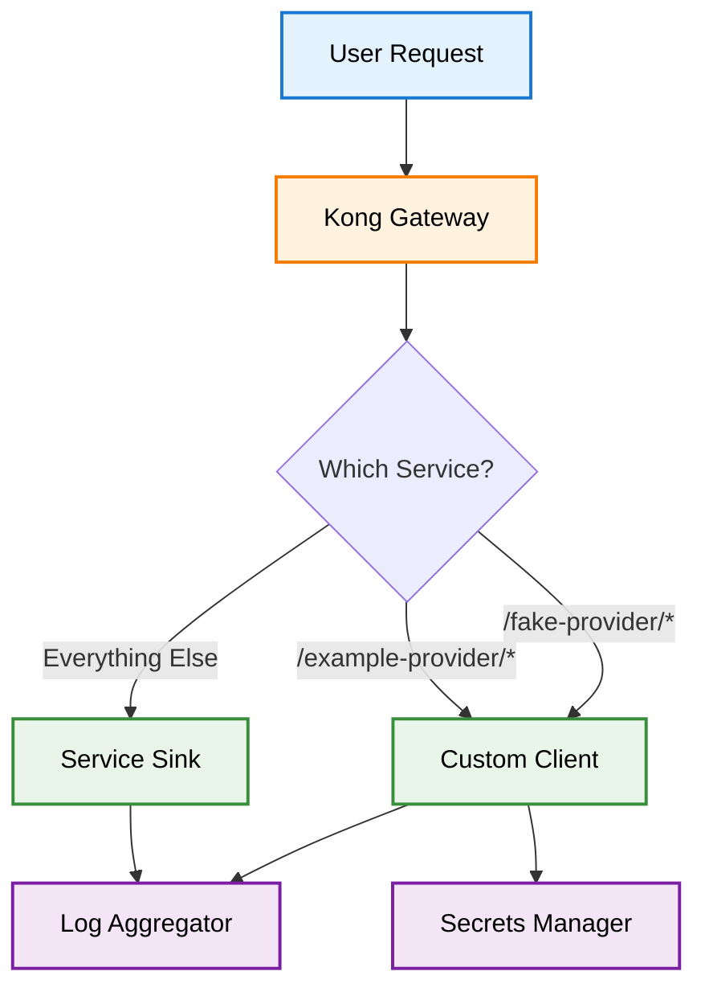
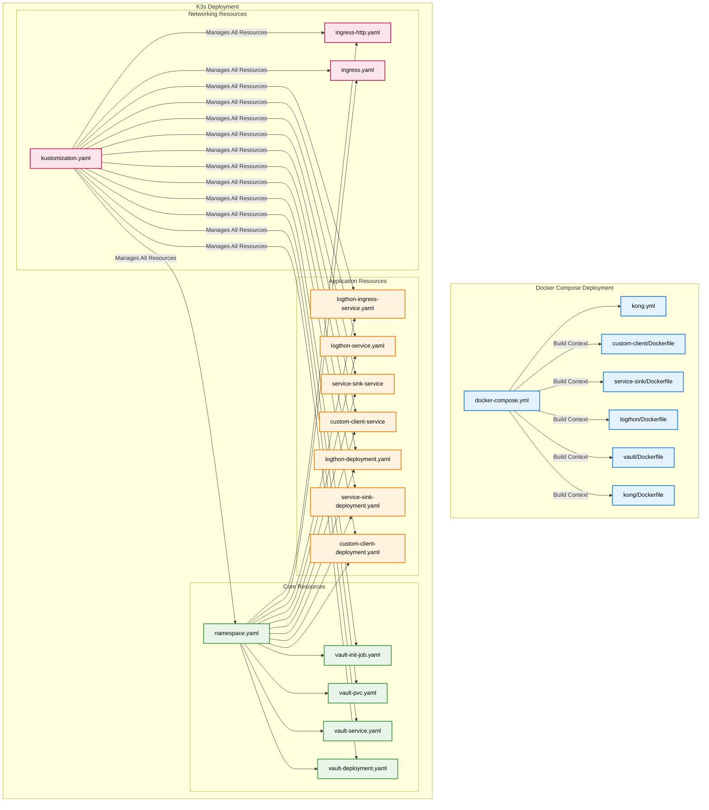

# Edge-Terrarium - Learning Docker & K3s

A hands-on project that teaches Docker containerization and K3s orchestration through a real-world application. Start with simple Docker containers and progress to full K3s deployment with ingress routing, secrets management, and monitoring.

## Table of Contents

### Getting Started
- [What You'll Learn](#what-youll-learn)
- [Prerequisites](#prerequisites)
- [Quick Start](#quick-start)

### Learning Path
- [Part 1: Understanding the Application](#part-1-understanding-the-application)
- [Part 2: Docker Basics](#part-2-docker-basics)
- [Part 3: K3s Introduction](#part-3-k3s-introduction)
- [Part 4: Advanced Features](#part-4-advanced-features)

### Reference
- [Project Structure](#project-structure)
- [Configuration Details](#configuration-details)
- [Service Communication](#service-communication)
- [Adding New Services](#adding-new-services)
- [Modifying Existing Services](#modifying-existing-services)
- [Troubleshooting](#troubleshooting)
- [Development](#development)

---

## What You'll Learn

This project teaches you:

### Docker Fundamentals
- Containerizing applications
- Multi-container orchestration with Docker Compose
- Service networking and communication
- Volume management and data persistence

### K3s Basics
- Pods, Services, and Deployments
- Ingress controllers and routing
- Secrets management with Vault
- Health checks and monitoring

### Production Concepts
- API Gateway patterns with Kong
- Load balancing and service discovery
- TLS/SSL certificate management
- Log aggregation and monitoring

### DevOps Practices
- Infrastructure as Code
- Automated testing and validation
- CI/CD pipeline concepts
- Environment management

## Prerequisites

### Required Software
- **Docker Desktop** (includes Docker Compose)
- **k3d** (K3s in Docker) - [Installation Guide](https://k3d.io/v5.4.6/#installation)
- **kubectl** (K3s command-line tool)
- **curl** (for testing HTTP endpoints)

### System Requirements
- **macOS/Linux**: Native support
- **Windows**: WSL2 (Windows Subsystem for Linux) - [WSL2 Setup Guide](https://docs.microsoft.com/en-us/windows/wsl/install)

### Knowledge Assumptions
- Basic command-line usage
- Understanding of HTTP requests and responses
- Familiarity with JSON format

## Quick Start

### Option 1: Docker (Recommended to start here)
```bash
# Clone the repository
git clone <repository-url>
cd c-edge-terrarium

# Deploy with Docker Compose
./scripts/deploy.sh docker deploy

# Test the application
./scripts/test-setup.sh
```

### Option 2: K3s (Recommended if you're familiar with containers)
```bash
# Deploy to K3s
./scripts/deploy.sh k3s deploy

# Test the application
./scripts/test-k3s.sh
```

### Available Script Arguments

#### Main Deploy Script (`./scripts/deploy.sh`)
```bash
# Syntax: ./scripts/deploy.sh [ENVIRONMENT] [ACTION]

# ENVIRONMENT options:
docker    # Deploy to Docker Compose (development)
k3s       # Deploy to K3s via k3d (Kubernetes testing)

# ACTION options:
deploy    # Deploy the application (default)
test      # Test the deployed application
clean     # Clean up the deployment
logs      # Show application logs

# Examples:
./scripts/deploy.sh docker deploy    # Deploy to Docker Compose
./scripts/deploy.sh k3s deploy       # Deploy to K3s (auto-creates k3d cluster if needed)
./scripts/deploy.sh k3s test         # Test K3s deployment
./scripts/deploy.sh docker clean     # Clean up Docker Compose
./scripts/deploy.sh k3s clean        # Clean up K3s deployment (deletes k3d cluster)
./scripts/deploy.sh docker logs      # Show Docker Compose logs
./scripts/deploy.sh k3s logs         # Show K3s logs
```

#### Other Available Scripts
```bash
# Build Docker images
./scripts/build-images.sh           # Build images for Docker Compose
./scripts/build-images-k3s.sh       # Build images for K3s

# Testing scripts
./scripts/test-setup.sh             # Test Docker Compose deployment
./scripts/test-k3s.sh               # Test K3s deployment

# Utility scripts
./scripts/generate-tls-certs.sh     # Generate TLS certificates
./scripts/init-vault.sh             # Initialize Vault with secrets
./scripts/create-k3s-tls-secret.sh  # Create K3s TLS secret
./scripts/cleanup-old-pods.sh       # Clean up old K3s pods
```

**Goal**: Get the application running in 5 minutes, then explore each component.

---

## Part 1: Understanding the Application

### What is Edge-Terrarium?

Edge-Terrarium is a **microservices application** that demonstrates how modern applications are built using containers. Think of it as a simplified version of what you'd see in production.

### The Application Components



### Component Definitions

- **Kong Gateway**: API gateway that routes HTTP requests based on URL patterns
- **Custom Client**: C application that handles requests to `/fake-provider/*` and `/example-provider/*` paths
- **Service Sink**: C application that handles all other HTTP requests as the default route
- **Log Aggregator**: Python service that collects and displays logs from all applications
- **Secrets Manager**: HashiCorp Vault that securely stores and provides application secrets

### Why This Architecture?

1. **Scalability**: Each service can be scaled independently
2. **Reliability**: If one service fails, others keep working
3. **Maintainability**: Teams can work on different services
4. **Security**: Secrets are managed centrally and securely

---

## Part 2: Docker Basics

### What is Docker?

Docker is a containerization platform that packages applications and their dependencies into lightweight, portable containers. Containers provide process isolation and resource management while sharing the host operating system kernel.

### Key Docker Concepts

| Concept | Definition | Purpose |
|---------|------------|---------|
| **Container** | Runtime instance of a Docker image | Isolated process environment with application and dependencies |
| **Image** | Immutable template containing application code and dependencies | Blueprint for creating containers |
| **Dockerfile** | Text file with instructions for building Docker images | Defines how to construct the application environment |
| **Docker Compose** | Tool for defining and running multi-container applications | Orchestrates multiple containers with networking and volumes |

### Running Edge-Terrarium with Docker

#### Step 1: Build the Images
```bash
# This creates Docker images for each service
./scripts/build-images.sh
```

**What happens**: Docker reads the Dockerfile in each service directory and creates a runnable image.

#### Step 2: Start the Services
```bash
# This starts all services and connects them
./scripts/deploy.sh docker deploy
```

**What happens**: Docker Compose reads `configs/docker/docker-compose.yml` and:
- Starts 5 containers (custom-client, service-sink, logthon, vault, kong)
- Creates a network so they can talk to each other
- Sets up port mappings so you can access them

#### Step 3: Test the Application
```bash
# This sends test requests to verify everything works
./scripts/test-setup.sh
```

### Understanding Docker Compose

The `configs/docker/docker-compose.yml` file is like a recipe that tells Docker:

```yaml
services:
  custom-client:
    build: ../../custom-client    # Build from this directory
    ports:
      - "1337:1337"               # Map host port 1337 to container port 1337
    environment:
      - LOGTHON_URL=http://logthon:5000  # How to reach the log service
```

**Key Points**:
- Each service runs in its own container
- Services communicate using service names (e.g., `logthon:5000`)
- Port mapping allows external access (e.g., `localhost:1337`)

### Docker Networking

When you run `docker-compose up`, Docker creates a network where:

- `custom-client` can reach `logthon` at `http://logthon:5000`
- `service-sink` can reach `logthon` at `http://logthon:5000`
- You can reach Kong at `https://localhost:8443`

This is **service discovery** - containers find each other by name, not IP address.

---

## Part 3: K3s Introduction

### What is K3s?

K3s is a lightweight Kubernetes distribution designed for resource-constrained environments. It provides the core Kubernetes functionality with reduced complexity and resource requirements.

### K3s vs Kubernetes Differences

| Aspect | Kubernetes | K3s |
|--------|------------|-----|
| **Size** | ~1GB+ | ~50MB |
| **Components** | Multiple separate binaries | Single binary |
| **Storage** | etcd (default) | SQLite (default), supports etcd |
| **Networking** | CNI plugins required | Built-in Flannel |
| **Load Balancer** | External load balancer required | Built-in service load balancer |
| **Use Case** | Production clusters | Development, edge, IoT |

### Key K3s Concepts

| Concept | Docker Equivalent | Definition |
|---------|------------------|------------|
| **Pod** | Container | Smallest deployable unit containing one or more containers |
| **Deployment** | Docker Compose service | Manages replica sets and rolling updates |
| **Service** | Docker network | Provides stable network endpoint for pods |
| **Ingress** | Kong Gateway | Routes external HTTP/HTTPS traffic to services |
| **Namespace** | Docker Compose project | Logical isolation boundary for resources |

### Running Edge-Terrarium with K3s

#### Step 1: Create a K3s Cluster
```bash
# This creates a local K3s cluster using k3d
./scripts/deploy.sh k3s deploy
```

**What happens**: 
- k3d creates a K3s cluster inside Docker containers
- This simulates a real K3s cluster on your local machine

#### Step 2: Deploy the Application
The script automatically:
- Builds Docker images
- Loads them into the K3s cluster
- Creates all the K3s resources (pods, services, ingress)

#### Step 3: Test the Application
```bash
# This tests the K3s deployment
./scripts/test-k3s.sh
```

#### Step 4: Access the Kubernetes Dashboard
```bash
# The dashboard token is displayed during deployment
# Access the dashboard at: https://localhost:9443
# Use the bearer token from the deployment output
```

**Dashboard Features**:
- Monitor pod health and resource usage
- View application logs
- Scale deployments
- Manage services and ingress
- Access cluster configuration

### YAML Configuration Architecture

The following diagram shows how YAML configuration files work together for both Docker Compose and K3s deployments:



**Key Relationships**:
- **Docker Compose**: Single `docker-compose.yml` orchestrates all services with Kong configuration
- **K3s**: Multiple YAML files managed by `kustomization.yaml` for declarative deployment
- **Build Context**: Dockerfiles define how each service is containerized
- **Resource Dependencies**: Namespace must be created before other resources

### Understanding K3s Resources

#### Pods
```yaml
# A pod runs one or more containers
apiVersion: v1
kind: Pod
metadata:
  name: custom-client-pod
spec:
  containers:
  - name: custom-client
    image: edge-terrarium-custom-client:latest
    ports:
    - containerPort: 1337
```

#### Services
```yaml
# A service provides stable network access to pods
apiVersion: v1
kind: Service
metadata:
  name: custom-client-service
spec:
  selector:
    app: custom-client
  ports:
  - port: 1337
    targetPort: 1337
```

#### Ingress
```yaml
# An ingress routes external traffic to services
apiVersion: networking.k8s.io/v1
kind: Ingress
metadata:
  name: edge-terrarium-ingress
spec:
  rules:
  - host: localhost
    http:
      paths:
      - path: /fake-provider
        pathType: Prefix
        backend:
          service:
            name: custom-client-service
            port:
              number: 1337
```

### K3d Cluster Architecture

When you run `./scripts/deploy.sh k3s deploy`, k3d creates a local K3s cluster using Docker containers. Understanding these containers helps with troubleshooting and cluster management.

#### K3d Container Components


#### Container Descriptions

| Container | Purpose | Key Functions |
|-----------|---------|---------------|
| **k3d-edge-terrarium-server-0** | K3s control plane node | - Runs K3s server (API server, etcd, scheduler, controller-manager)<br/>- Manages cluster state and configuration<br/>- Handles API requests and resource management<br/>- Runs system pods (CoreDNS, Traefik, etc.) |
| **k3d-edge-terrarium-agent-0/1** | K3s worker nodes | - Run application pods and workloads<br/>- Execute container runtime (containerd)<br/>- Report node status to server<br/>- Handle pod networking and storage |
| **k3d-edge-terrarium-serverlb** | HAProxy load balancer | - Distributes traffic across server nodes<br/>- Provides external access to cluster services<br/>- Maps host ports to cluster services<br/>- Handles TLS termination for ingress |

#### Container Management Commands

```bash
# View all k3d containers
docker ps --filter "label=k3d.cluster=edge-terrarium"

# View specific container logs
docker logs k3d-edge-terrarium-server-0
docker logs k3d-edge-terrarium-agent-0
docker logs k3d-edge-terrarium-serverlb

# Access container shell
docker exec -it k3d-edge-terrarium-server-0 sh
docker exec -it k3d-edge-terrarium-agent-0 sh

# View container resource usage
docker stats k3d-edge-terrarium-server-0 k3d-edge-terrarium-agent-0 k3d-edge-terrarium-serverlb
```

#### Container Networking

- **Internal Network**: All containers communicate via `k3d-edge-terrarium` Docker network
- **Port Mapping**: serverlb container maps host ports to cluster services
- **Service Discovery**: Pods use Kubernetes DNS for internal communication
- **Ingress**: Kong ingress controller runs in the cluster and routes external traffic

### K3s vs Docker: Key Differences

| Aspect | Docker Compose | K3s |
|--------|---------------|-----|
| **Scale** | Single machine | Multiple machines |
| **Networking** | Docker network | K3s service mesh |
| **Health Checks** | Basic restart | Advanced probes and healing |
| **Updates** | Manual restart | Rolling updates |
| **Configuration** | Environment variables | ConfigMaps and Secrets |

### Physical Deployment Architecture

#### Docker Compose Deployment


#### K3s Deployment


### Kubernetes Dashboard

The Kubernetes Dashboard provides a web-based user interface for managing and monitoring your K3s cluster. It's automatically installed and configured during K3s deployment.

#### Dashboard Features

| Feature | Description |
|---------|-------------|
| **Cluster Overview** | View cluster health, nodes, and resource usage |
| **Pod Management** | Monitor, scale, and restart pods |
| **Service Discovery** | View services, endpoints, and networking |
| **Resource Monitoring** | CPU, memory, and storage usage |
| **Log Viewing** | Access pod logs directly from the UI |
| **Configuration** | View and edit ConfigMaps, Secrets, and other resources |

#### Accessing the Dashboard

After running `./scripts/deploy.sh k3s deploy`, the dashboard token is automatically generated and displayed:

```bash
==========================================
KUBERNETES DASHBOARD ACCESS INFORMATION
==========================================
Dashboard Token: eyJhbGciOiJSUzI1NiIsImtpZCI6...
Access Methods:
1. Port Forward Access (Recommended):
   Command: kubectl -n kubernetes-dashboard port-forward svc/kubernetes-dashboard-kong-proxy 9443:443
   URL: https://localhost:9443
   Token: eyJhbGciOiJSUzI1NiIsImtpZCI6...

2. Direct LoadBalancer Access (Alternative):
   URL: https://localhost:443 (may conflict with main Kong ingress)
   Token: eyJhbGciOiJSUzI1NiIsImtpZCI6...
==========================================
```

#### Using the Dashboard

1. **Open the Dashboard**: Navigate to `https://localhost:9443`
2. **Select Authentication Method**: Choose "Token"
3. **Enter Token**: Paste the bearer token from the deployment output
4. **Explore**: Use the left sidebar to navigate between different resources

#### Dashboard Navigation

| Section | Purpose | Key Features |
|---------|---------|--------------|
| **Cluster** | Cluster-wide resources | Nodes, Namespaces, Persistent Volumes |
| **Workloads** | Application resources | Pods, Deployments, Services, Ingress |
| **Service** | Networking resources | Services, Endpoints, Ingress |
| **Storage** | Storage resources | Persistent Volumes, Storage Classes |
| **Configuration** | Configuration resources | ConfigMaps, Secrets, Resource Quotas |
| **Access Control** | Security resources | Service Accounts, Roles, Role Bindings |

#### Troubleshooting Dashboard Access

If you can't access the dashboard:

1. **Check if the dashboard is running**:
   ```bash
   kubectl get pods -n kubernetes-dashboard
   ```

2. **Verify the service**:
   ```bash
   kubectl get svc -n kubernetes-dashboard
   ```

3. **Check for port conflicts**:
```bash
   lsof -i :9443
   ```

4. **Regenerate the token**:
   ```bash
   kubectl -n kubernetes-dashboard create token dashboard-admin
   ```

#### Dashboard Security

The dashboard is configured with:
- **Service Account**: `dashboard-admin` with cluster-admin privileges
- **Token-based Authentication**: Secure bearer token authentication
- **Namespace Isolation**: Runs in dedicated `kubernetes-dashboard` namespace
- **LoadBalancer Access**: Direct access via k3d port mapping

### K3s Container and Pod Management

#### Viewing Pods and Containers

```bash
# List all pods in the edge-terrarium namespace
kubectl get pods -n edge-terrarium

# List all pods across all namespaces
kubectl get pods --all-namespaces

# Get detailed pod information
kubectl describe pod <pod-name> -n edge-terrarium

# List pods with wide output (shows node and IP)
kubectl get pods -n edge-terrarium -o wide

# Watch pods in real-time
kubectl get pods -n edge-terrarium -w
```

#### Container Logs

```bash
# View logs for a specific pod
kubectl logs <pod-name> -n edge-terrarium

# View logs for a specific container in a pod
kubectl logs <pod-name> -c <container-name> -n edge-terrarium

# Follow logs in real-time (like tail -f)
kubectl logs -f <pod-name> -n edge-terrarium

# View logs from all containers in a pod
kubectl logs <pod-name> --all-containers=true -n edge-terrarium

# View logs from previous container instance (if pod restarted)
kubectl logs <pod-name> --previous -n edge-terrarium

# View logs with timestamps
kubectl logs <pod-name> --timestamps=true -n edge-terrarium

# View logs from deployment (gets logs from all pods in deployment)
kubectl logs deployment/<deployment-name> -n edge-terrarium
```

#### Container Management

```bash
# Execute commands in a running container
kubectl exec -it <pod-name> -n edge-terrarium -- /bin/sh
kubectl exec -it <pod-name> -c <container-name> -n edge-terrarium -- /bin/sh

# Run a one-time command in a container
kubectl exec <pod-name> -n edge-terrarium -- ls -la

# Copy files to/from containers
kubectl cp <local-file> <pod-name>:/path/to/destination -n edge-terrarium
kubectl cp <pod-name>:/path/to/file <local-destination> -n edge-terrarium

# Port forward to access services locally
kubectl port-forward pod/<pod-name> 8080:8080 -n edge-terrarium
kubectl port-forward service/<service-name> 8080:8080 -n edge-terrarium
```

#### Pod Lifecycle Management

```bash
# Restart a deployment (rolling restart)
kubectl rollout restart deployment/<deployment-name> -n edge-terrarium

# Scale a deployment
kubectl scale deployment <deployment-name> --replicas=3 -n edge-terrarium

# Delete a pod (will be recreated by deployment)
kubectl delete pod <pod-name> -n edge-terrarium

# Delete a deployment
kubectl delete deployment <deployment-name> -n edge-terrarium

# Get deployment status
kubectl rollout status deployment/<deployment-name> -n edge-terrarium

# View deployment history
kubectl rollout history deployment/<deployment-name> -n edge-terrarium
```

#### Resource Monitoring

```bash
# View resource usage for pods
kubectl top pods -n edge-terrarium

# View resource usage for nodes
kubectl top nodes

# View resource usage for specific pod
kubectl top pod <pod-name> -n edge-terrarium

# Get resource quotas
kubectl describe quota -n edge-terrarium

# View events in namespace
kubectl get events -n edge-terrarium --sort-by='.lastTimestamp'
```

#### Troubleshooting Commands

```bash
# Check pod status and events
kubectl describe pod <pod-name> -n edge-terrarium

# Check service endpoints
kubectl get endpoints -n edge-terrarium

# Check ingress status
kubectl describe ingress -n edge-terrarium

# Check persistent volumes
kubectl get pv,pvc -n edge-terrarium

# Check secrets and configmaps
kubectl get secrets,configmaps -n edge-terrarium

# View cluster info
kubectl cluster-info

# Check node status
kubectl get nodes -o wide
```

---

## Part 4: Advanced Features

### Secrets Management with Vault

**Problem**: Applications need passwords, API keys, and certificates, but storing them in code is insecure.

**Solution**: HashiCorp Vault stores secrets securely and provides them to applications when needed.

#### How It Works
1. Vault stores secrets encrypted
2. Applications authenticate with Vault
3. Vault provides secrets to authenticated applications
4. Secrets are never stored in application code

#### Example: Custom Client Retrieving Secrets
```c
// The application requests a secret from Vault
get_vault_secret("custom-client/config", "api_key", secrets->api_key, sizeof(secrets->api_key));

// Vault returns: "mock-api-key-12345"
```

#### Pod-to-Vault Communication

Pods in the K3s cluster communicate with Vault using Kubernetes internal DNS addresses. This ensures secure, internal communication without exposing Vault to external networks.

##### Internal Address Resolution


##### Address Formats

| Environment | Vault Address | DNS Resolution |
|-------------|---------------|----------------|
| **Docker Compose** | `http://vault:8200` | Container name resolution |
| **K3s** | `http://vault-service.edge-terrarium.svc.cluster.local:8200` | Kubernetes DNS resolution |

##### Environment Variables

Pods are configured with the following environment variables to reach Vault:

```yaml
env:
- name: VAULT_ADDR
  value: "http://vault-service.edge-terrarium.svc.cluster.local:8200"
- name: VAULT_TOKEN
  value: "root"
```

##### DNS Resolution Process

1. **Pod makes request** to `vault-service.edge-terrarium.svc.cluster.local:8200`
2. **Kubernetes DNS** resolves to Vault service ClusterIP (e.g., `10.43.123.45:8200`)
3. **Service** forwards request to Vault pod IP (e.g., `10.42.67.89:8200`)
4. **Vault pod** processes the request and returns response
5. **Response** follows the same path back to the requesting pod

##### Network Security

- **Internal Communication**: All Vault communication happens within the cluster network
- **No External Exposure**: Vault is not accessible from outside the cluster
- **Service Mesh**: Traffic is encrypted and authenticated within the cluster
- **Namespace Isolation**: Only pods in the same namespace can access Vault by default

#### Vault CRUD Operations

Vault provides a REST API for managing secrets. Here are common operations using curl:

##### Authentication

```bash
# Set Vault address and token
export VAULT_ADDR="http://localhost:8200"  # Docker
# export VAULT_ADDR="http://localhost:8200"  # K3s (via port-forward)
export VAULT_TOKEN="root"

# Verify authentication
curl -H "X-Vault-Token: $VAULT_TOKEN" $VAULT_ADDR/v1/auth/token/lookup-self
```

##### Secret Management (KV v2 Engine)

```bash
# Create/Update a secret
curl -X POST \
  -H "X-Vault-Token: $VAULT_TOKEN" \
  -H "Content-Type: application/json" \
  -d '{"data": {"api_key": "secret-api-key-12345", "database_url": "postgresql://user:pass@db:5432/app"}}' \
  $VAULT_ADDR/v1/secret/data/custom-client/config

# Read a secret
curl -H "X-Vault-Token: $VAULT_TOKEN" \
  $VAULT_ADDR/v1/secret/data/custom-client/config

# Read specific field from secret
curl -H "X-Vault-Token: $VAULT_TOKEN" \
  $VAULT_ADDR/v1/secret/data/custom-client/config | jq '.data.data.api_key'

# List secrets (shows keys, not values)
curl -H "X-Vault-Token: $VAULT_TOKEN" \
  $VAULT_ADDR/v1/secret/metadata/custom-client

# Delete a secret
curl -X DELETE \
  -H "X-Vault-Token: $VAULT_TOKEN" \
  $VAULT_ADDR/v1/secret/data/custom-client/config

# Delete secret metadata (permanent deletion)
curl -X DELETE \
  -H "X-Vault-Token: $VAULT_TOKEN" \
  $VAULT_ADDR/v1/secret/metadata/custom-client/config
```

##### Policy Management

```bash
# Create a policy
curl -X POST \
  -H "X-Vault-Token: $VAULT_TOKEN" \
  -H "Content-Type: application/json" \
  -d '{"policy": "path \"secret/data/custom-client/*\" { capabilities = [\"read\"] }"}' \
  $VAULT_ADDR/v1/sys/policies/acl/custom-client-policy

# List policies
curl -H "X-Vault-Token: $VAULT_TOKEN" \
  $VAULT_ADDR/v1/sys/policies/acl

# Read a policy
curl -H "X-Vault-Token: $VAULT_TOKEN" \
  $VAULT_ADDR/v1/sys/policies/acl/custom-client-policy

# Delete a policy
curl -X DELETE \
  -H "X-Vault-Token: $VAULT_TOKEN" \
  $VAULT_ADDR/v1/sys/policies/acl/custom-client-policy
```

##### Token Management

```bash
# Create a new token
curl -X POST \
  -H "X-Vault-Token: $VAULT_TOKEN" \
  -H "Content-Type: application/json" \
  -d '{"policies": ["custom-client-policy"], "ttl": "1h"}' \
  $VAULT_ADDR/v1/auth/token/create

# Renew a token
curl -X POST \
  -H "X-Vault-Token: $VAULT_TOKEN" \
  -H "Content-Type: application/json" \
  -d '{"token": "your-token-here"}' \
  $VAULT_ADDR/v1/auth/token/renew

# Revoke a token
curl -X POST \
  -H "X-Vault-Token: $VAULT_TOKEN" \
  -H "Content-Type: application/json" \
  -d '{"token": "your-token-here"}' \
  $VAULT_ADDR/v1/auth/token/revoke
```

##### Health and Status

```bash
# Check Vault health
curl $VAULT_ADDR/v1/sys/health

# Get Vault status
curl -H "X-Vault-Token: $VAULT_TOKEN" \
  $VAULT_ADDR/v1/sys/status

# List enabled auth methods
curl -H "X-Vault-Token: $VAULT_TOKEN" \
  $VAULT_ADDR/v1/sys/auth

# List enabled secret engines
curl -H "X-Vault-Token: $VAULT_TOKEN" \
  $VAULT_ADDR/v1/sys/mounts
```

##### Example: Complete Secret Lifecycle

```bash
# 1. Create a secret
curl -X POST \
  -H "X-Vault-Token: $VAULT_TOKEN" \
  -H "Content-Type: application/json" \
  -d '{"data": {"username": "admin", "password": "secure-password-123"}}' \
  $VAULT_ADDR/v1/secret/data/app/credentials

# 2. Read the secret
curl -H "X-Vault-Token: $VAULT_TOKEN" \
  $VAULT_ADDR/v1/secret/data/app/credentials

# 3. Update the secret
curl -X POST \
  -H "X-Vault-Token: $VAULT_TOKEN" \
  -H "Content-Type: application/json" \
  -d '{"data": {"username": "admin", "password": "new-secure-password-456"}}' \
  $VAULT_ADDR/v1/secret/data/app/credentials

# 4. List all secrets under app/
curl -H "X-Vault-Token: $VAULT_TOKEN" \
  $VAULT_ADDR/v1/secret/metadata/app

# 5. Delete the secret
curl -X DELETE \
  -H "X-Vault-Token: $VAULT_TOKEN" \
  $VAULT_ADDR/v1/secret/data/app/credentials
```

##### Error Handling

```bash
# Common error responses
# 400 Bad Request - Invalid JSON or missing required fields
# 403 Forbidden - Insufficient permissions
# 404 Not Found - Secret or path doesn't exist
# 500 Internal Server Error - Vault server error

# Example error response
{
  "errors": [
    "permission denied"
  ]
}
```

### API Gateway with Kong

**Problem**: Multiple services need a single entry point for external traffic.

**Solution**: Kong acts as a reverse proxy that routes requests to the appropriate service.

#### Kong Routing Rules

| Request Path | Destination Service | Port | Method | Purpose |
|-------------|-------------------|------|--------|---------|
| `/fake-provider/*` | Custom Client | 1337 | GET/POST | Special handling for fake provider requests |
| `/example-provider/*` | Custom Client | 1337 | GET/POST | Special handling for example provider requests |
| `/health` | Custom Client | 1337 | GET | Health check endpoint |
| `/api/*` | Service Sink | 8080 | GET/POST | API endpoint requests |
| `/admin/*` | Service Sink | 8080 | GET/POST | Admin interface requests |
| `/` (root) | Service Sink | 8080 | GET | Default handler for all other requests |
| `/*` (catch-all) | Service Sink | 8080 | GET/POST | Fallback for unmatched routes |

#### Kong Configuration Details

**Docker Compose Configuration** (`configs/docker/kong/kong.yml`):
```yaml
services:
  - name: custom-client
    url: http://custom-client:1337
    routes:
      - name: custom-client-route
        paths:
          - /fake-provider
          - /example-provider
        methods:
          - GET
          - POST
        strip_path: true
        preserve_host: true

  - name: service-sink
    url: http://service-sink:8080
    routes:
      - name: service-sink-route
        paths:
          - /
        methods:
          - GET
          - POST
        strip_path: false
        preserve_host: true
```

**K3s Ingress Configuration** (`configs/k3s/ingress.yaml`):
```yaml
apiVersion: networking.k8s.io/v1
kind: Ingress
metadata:
  name: edge-terrarium-ingress
  annotations:
    konghq.com/strip-path: "true"
spec:
  ingressClassName: kong
  rules:
  - host: localhost
    http:
      paths:
      - path: /fake-provider
        pathType: Prefix
        backend:
          service:
            name: custom-client-service
            port:
              number: 1337
      - path: /example-provider
        pathType: Prefix
        backend:
          service:
            name: custom-client-service
            port:
              number: 1337
      - path: /
        pathType: Prefix
        backend:
          service:
            name: service-sink-service
            port:
              number: 8080
```

#### Routing Priority

Kong processes routes in the following order:
1. **Exact path matches** (e.g., `/fake-provider/test`)
2. **Prefix matches** (e.g., `/fake-provider/*`)
3. **Catch-all routes** (e.g., `/`)

This ensures that specific routes are handled before general ones.

### Health Checks and Monitoring

**Problem**: How do you know if your application is healthy?

**Solution**: Kubernetes health checks automatically monitor and restart unhealthy containers.

#### Types of Health Checks
- **Liveness Probe**: "Is the application running?" (every 30 seconds)
- **Readiness Probe**: "Is the application ready to serve traffic?" (every 10 seconds)

#### Example Health Check
```yaml
livenessProbe:
  httpGet:
    path: /health
    port: 1337
  periodSeconds: 30
  httpHeaders:
  - name: X-Probe-Type
    value: liveness
```

### Log Aggregation

**Problem**: Multiple services generate logs, making debugging difficult.

**Solution**: Logthon collects logs from all services and provides a web interface.

#### How Logs Flow
1. Custom Client logs: "Received request to /fake-provider/test"
2. Service Sink logs: "Received request to /api/users"
3. Logthon collects all logs
4. Web UI displays logs in real-time with container IDs

---

## Project Structure

### Directory Tree Visualization


### Detailed Directory Structure

```
c-edge-terrarium/
├── custom-client/           # C application for special requests
│   ├── main.c              # Source code
│   └── Dockerfile          # Container build instructions
├── service-sink/           # C application for default requests
│   ├── main.c              # Source code
│   └── Dockerfile          # Container build instructions
├── logthon/                # Python log aggregation service
│   ├── main.py             # FastAPI application
│   ├── logthon/            # Python package
│   │   ├── __init__.py
│   │   ├── api.py          # API endpoints
│   │   ├── app.py          # FastAPI app
│   │   ├── config.py       # Configuration
│   │   ├── models.py       # Data models
│   │   ├── storage.py      # Log storage
│   │   ├── ui.py           # Web UI
│   │   └── websocket_manager.py
│   ├── pyproject.toml      # Python dependencies
│   ├── test_modular.py     # Tests
│   └── Dockerfile          # Container build instructions
├── configs/
│   ├── docker/             # Docker Compose configuration
│   │   ├── docker-compose.yml
│   │   ├── certs/          # TLS certificates for Docker
│   │   └── kong/           # Kong Gateway configuration
│   │       └── kong.yml
│   └── k3s/                # Kubernetes manifests
│       ├── namespace.yaml
│       ├── custom-client-deployment.yaml
│       ├── service-sink-deployment.yaml
│       ├── logthon-deployment.yaml
│       ├── vault-deployment.yaml
│       ├── vault-service.yaml
│       ├── vault-pvc.yaml
│       ├── vault-init-job.yaml
│       ├── vault-config.yaml
│       ├── vault-ingress.yaml
│       ├── services.yaml
│       ├── logthon-service.yaml
│       ├── logthon-ingress-service.yaml
│       ├── logthon-ingress.yaml
│       ├── ingress.yaml
│       ├── ingress-http.yaml
│       └── kustomization.yaml
├── scripts/                # Automation scripts
│   ├── deploy.sh           # Main deployment script
│   ├── build-images.sh     # Docker image building
│   ├── build-images-k3s.sh # K3s image building
│   ├── test-setup.sh       # Docker testing
│   ├── test-k3s.sh         # Kubernetes testing
│   ├── generate-tls-certs.sh # Certificate generation
│   ├── init-vault.sh       # Vault initialization
│   ├── create-k3s-tls-secret.sh # K3s TLS secret creation
│   └── cleanup-old-pods.sh # Pod cleanup
└── certs/                  # TLS certificates
```

### Directory Purpose

| Directory | Purpose | Key Files |
|-----------|---------|-----------|
| `custom-client/` | C application handling `/fake-provider/*` and `/example-provider/*` routes | `main.c`, `Dockerfile` |
| `service-sink/` | C application handling all other HTTP requests | `main.c`, `Dockerfile` |
| `logthon/` | Python FastAPI service for log aggregation and web UI | `main.py`, `logthon/`, `pyproject.toml` |
| `configs/docker/` | Docker Compose orchestration and Kong configuration | `docker-compose.yml`, `kong/kong.yml` |
| `configs/k3s/` | Kubernetes manifests for declarative deployment | `*-deployment.yaml`, `services.yaml`, `ingress.yaml` |
| `scripts/` | Automation scripts for building, deploying, and testing | `deploy.sh`, `build-images.sh`, `test-*.sh` |
| `certs/` | TLS certificates for secure communication | Certificate files |

---

## Configuration Details

### Environment Variables

| Variable | Purpose | Example Value |
|----------|---------|---------------|
| `LOGTHON_HOST` | Log service hostname | `logthon-ingress-service.edge-terrarium.svc.cluster.local` |
| `LOGTHON_PORT` | Log service port | `5000` |
| `VAULT_ADDR` | Vault server address | `http://vault.edge-terrarium.svc.cluster.local:8200` |
| `VAULT_TOKEN` | Vault authentication token | `root` |
| `HOSTNAME` | Container ID (pod name) | `custom-client-844879c699-qs76w` |

### Routing Configuration

#### Docker Compose (Kong Gateway)
```yaml
# configs/docker/kong/kong.yml
services:
  - name: custom-client
    url: http://custom-client:1337
    routes:
      - name: custom-client-route
        paths:
          - /fake-provider
          - /example-provider
```

#### Kubernetes (Kong Ingress)
```yaml
# configs/k3s/ingress.yaml
apiVersion: networking.k8s.io/v1
kind: Ingress
metadata:
  name: edge-terrarium-ingress
spec:
  ingressClassName: kong
  rules:
  - host: localhost
    http:
      paths:
      - path: /fake-provider
        pathType: Prefix
        backend:
          service:
            name: custom-client-service
            port:
              number: 1337
```

---

## Testing

### Automated Testing

#### Docker Testing
```bash
./scripts/test-setup.sh
```
**Tests**:
- Service health checks
- HTTP request routing
- Log aggregation
- Vault connectivity

#### Kubernetes Testing
```bash
./scripts/test-k3s.sh
```
**Tests**:
- Pod status and health
- Ingress routing
- Service discovery
- Secrets retrieval
- Log aggregation

### K3s Testing Methods

K3s provides multiple ways to access and test your applications. Understanding these methods helps with development, debugging, and production deployment.

#### Method 1: Load Balancer Access (Recommended)

The k3d cluster automatically creates a load balancer that maps host ports to cluster services.

##### Access Points

| Service | Load Balancer URL | Purpose |
|---------|------------------|---------|
| **Kong Ingress** | `https://localhost:443` | Main application gateway |
| **Logthon Service** | `http://localhost:5001` | Log aggregation web UI |
| **Vault Service** | `http://localhost:8200` | Secrets management |
| **Kubernetes Dashboard** | `https://localhost:9443` | Cluster management UI |

##### Testing Commands

```bash
# Test Kong ingress routing
curl -k -H "Host: localhost" https://localhost:443/fake-provider/test
curl -k -H "Host: localhost" https://localhost:443/example-provider/test
curl -k -H "Host: localhost" https://localhost:443/api/test

# Test Logthon web UI
curl http://localhost:5001

# Test Vault API
curl http://localhost:8200/v1/sys/health

# Test Kubernetes Dashboard
curl -k https://localhost:9443
```

##### Advantages
- **Direct Access**: No additional setup required
- **Production-like**: Similar to real load balancer behavior
- **Persistent**: Access remains available across pod restarts
- **TLS Support**: Automatic HTTPS termination

#### Method 2: Port Forwarding

Port forwarding creates a direct tunnel from your local machine to a specific pod or service.

##### Service Port Forwarding

```bash
# Forward to a service (recommended)
kubectl port-forward service/custom-client-service 1337:1337 -n edge-terrarium
kubectl port-forward service/service-sink-service 8080:8080 -n edge-terrarium
kubectl port-forward service/logthon-service 5000:5000 -n edge-terrarium
kubectl port-forward service/vault-service 8200:8200 -n edge-terrarium

# Test forwarded services
curl http://localhost:1337/health
curl http://localhost:8080/health
curl http://localhost:5000
curl http://localhost:8200/v1/sys/health
```

##### Pod Port Forwarding

```bash
# Get pod name
kubectl get pods -n edge-terrarium

# Forward to specific pod
kubectl port-forward pod/custom-client-844879c699-qs76w 1337:1337 -n edge-terrarium
kubectl port-forward pod/service-sink-7d4f8b9c6e-abc12 8080:8080 -n edge-terrarium

# Test pod directly
curl http://localhost:1337/health
curl http://localhost:8080/health
```

##### Multiple Port Forwarding

```bash
# Forward multiple services simultaneously
kubectl port-forward service/custom-client-service 1337:1337 -n edge-terrarium &
kubectl port-forward service/service-sink-service 8080:8080 -n edge-terrarium &
kubectl port-forward service/logthon-service 5000:5000 -n edge-terrarium &
kubectl port-forward service/vault-service 8200:8200 -n edge-terrarium &

# Test all services
curl http://localhost:1337/health
curl http://localhost:8080/health
curl http://localhost:5000
curl http://localhost:8200/v1/sys/health

# Stop port forwarding
pkill -f "kubectl port-forward"
```

##### Advantages
- **Direct Pod Access**: Bypasses service load balancing
- **Debugging**: Access specific pod instances
- **Development**: Test individual services in isolation
- **Flexible**: Can forward to any pod or service

#### Method 3: Ingress Testing

Test the Kong ingress controller routing directly.

##### Ingress Access

```bash
# Test ingress routing through Kong
curl -k -H "Host: localhost" https://localhost:443/fake-provider/test
curl -k -H "Host: localhost" https://localhost:443/example-provider/test
curl -k -H "Host: localhost" https://localhost:443/api/test
curl -k -H "Host: localhost" https://localhost:443/health

# Test with different HTTP methods
curl -k -X POST -H "Host: localhost" -H "Content-Type: application/json" \
  -d '{"test": "data"}' https://localhost:443/fake-provider/test

# Test with custom headers
curl -k -H "Host: localhost" -H "X-Test-Header: value" \
  https://localhost:443/api/test
```

##### Ingress Debugging

```bash
# Check ingress status
kubectl get ingress -n edge-terrarium
kubectl describe ingress edge-terrarium-ingress -n edge-terrarium

# Check Kong ingress controller logs
kubectl logs -n kong deployment/ingress-kong -f

# Check service endpoints
kubectl get endpoints -n edge-terrarium
```

#### Method 4: Cluster Internal Testing

Test services from within the cluster using a debug pod.

##### Create Debug Pod

```bash
# Create a debug pod with curl
kubectl run debug-pod --image=curlimages/curl:latest -it --rm --restart=Never -n edge-terrarium -- sh

# Inside the debug pod, test services
curl http://custom-client-service.edge-terrarium.svc.cluster.local:1337/health
curl http://service-sink-service.edge-terrarium.svc.cluster.local:8080/health
curl http://logthon-service.edge-terrarium.svc.cluster.local:5000
curl http://vault-service.edge-terrarium.svc.cluster.local:8200/v1/sys/health
```

##### Test Service Discovery

```bash
# Test DNS resolution
nslookup custom-client-service.edge-terrarium.svc.cluster.local
nslookup service-sink-service.edge-terrarium.svc.cluster.local
nslookup logthon-service.edge-terrarium.svc.cluster.local
nslookup vault-service.edge-terrarium.svc.cluster.local

# Test service connectivity
telnet custom-client-service.edge-terrarium.svc.cluster.local 1337
telnet service-sink-service.edge-terrarium.svc.cluster.local 8080
```

#### Testing Best Practices

##### 1. Health Check Testing

```bash
# Test all health endpoints
curl -f http://localhost:1337/health || echo "Custom Client unhealthy"
curl -f http://localhost:8080/health || echo "Service Sink unhealthy"
curl -f http://localhost:5000/health || echo "Logthon unhealthy"
curl -f http://localhost:8200/v1/sys/health || echo "Vault unhealthy"
```

##### 2. Load Testing

```bash
# Simple load test with curl
for i in {1..10}; do
  curl -k -H "Host: localhost" https://localhost:443/fake-provider/test &
done
wait

# Test with different endpoints
for endpoint in "/fake-provider/test" "/example-provider/test" "/api/test"; do
  curl -k -H "Host: localhost" "https://localhost:443$endpoint"
done
```

##### 3. Error Testing

```bash
# Test non-existent endpoints
curl -k -H "Host: localhost" https://localhost:443/nonexistent
curl -k -H "Host: localhost" https://localhost:443/fake-provider/invalid

# Test with invalid methods
curl -k -X DELETE -H "Host: localhost" https://localhost:443/fake-provider/test
```

##### 4. Monitoring and Logs

```bash
# Monitor pod logs during testing
kubectl logs -f deployment/custom-client -n edge-terrarium &
kubectl logs -f deployment/service-sink -n edge-terrarium &
kubectl logs -f deployment/logthon -n edge-terrarium &

# Run tests
curl -k -H "Host: localhost" https://localhost:443/fake-provider/test

# Stop monitoring
pkill -f "kubectl logs"
```

### Manual Testing

#### Test Custom Client
```bash
# Docker
curl -H "Host: localhost" https://localhost:8443/fake-provider/test

# Kubernetes
curl -k -H "Host: localhost" https://localhost:443/fake-provider/test
```

#### Test Service Sink
```bash
# Docker
curl -H "Host: localhost" https://localhost:8443/api/test

# Kubernetes
curl -k -H "Host: localhost" https://localhost:443/api/test
```

#### View Logs
```bash
# Docker
docker logs edge-terrarium-logthon-1

# Kubernetes
kubectl logs -n edge-terrarium deployment/logthon
```

---

## Troubleshooting

### Common Issues

#### "Connection refused" errors
**Cause**: Service not running or port not accessible
**Solution**: Check service status and port mappings

#### "Failed to retrieve secrets from Vault"
**Cause**: Vault not initialized or network connectivity issues
**Solution**: Check Vault status and network connectivity

#### "No targets could be found" (Kong)
**Cause**: Backend services not ready
**Solution**: Wait for services to be ready, check health probes

### Docker Issues

#### Container won't start
```bash
# Check container logs
docker logs <container-name>

# Check container status
docker ps -a
```

#### Port already in use
```bash
# Find process using port
lsof -i :8443

# Kill process
kill -9 <PID>
```

### Kubernetes Issues

#### Pod stuck in Pending
```bash
# Check pod events
kubectl describe pod <pod-name> -n edge-terrarium

# Check resource limits
kubectl top pods -n edge-terrarium
```

#### Service not accessible
```bash
# Check service endpoints
kubectl get endpoints -n edge-terrarium

# Check ingress status
kubectl describe ingress -n edge-terrarium
```

---

## Service Communication

### Custom Client to Service Sink Communication

To enable Custom Client to communicate with Service Sink, you need to modify the Custom Client application and configuration.

#### Docker Compose Setup

1. **Update Custom Client source code** (`custom-client/main.c`):
```c
// Add function to communicate with Service Sink
void send_request_to_service_sink(const char* path, const char* data) {
    CURL *curl;
    CURLcode res;
    char service_sink_url[256];
    
    // Get Service Sink URL from environment or use default
    const char* service_sink_host = getenv("SERVICE_SINK_HOST");
    if (!service_sink_host) {
        service_sink_host = "service-sink";
    }
    const char* service_sink_port = getenv("SERVICE_SINK_PORT");
    if (!service_sink_port) {
        service_sink_port = "8080";
    }
    
    snprintf(service_sink_url, sizeof(service_sink_url), 
             "http://%s:%s%s", service_sink_host, service_sink_port, path);
    
    curl = curl_easy_init();
    if (curl) {
        curl_easy_setopt(curl, CURLOPT_URL, service_sink_url);
        curl_easy_setopt(curl, CURLOPT_POSTFIELDS, data);
        curl_easy_setopt(curl, CURLOPT_TIMEOUT, 5L);
        
        res = curl_easy_perform(curl);
        curl_easy_cleanup(curl);
    }
}
```

2. **Update Docker Compose configuration** (`configs/docker/docker-compose.yml`):
```yaml
services:
  custom-client:
    build: ../../custom-client
    ports:
      - "1337:1337"
    environment:
      - LOGTHON_URL=http://logthon:5000
      - SERVICE_SINK_HOST=service-sink
      - SERVICE_SINK_PORT=8080
    depends_on:
      - service-sink
      - logthon
```

#### K3s Setup

1. **Update Custom Client deployment** (`configs/k3s/custom-client-deployment.yaml`):
```yaml
apiVersion: apps/v1
kind: Deployment
metadata:
  name: custom-client
spec:
  template:
    spec:
      containers:
      - name: custom-client
        env:
        - name: LOGTHON_HOST
          value: "logthon-ingress-service.edge-terrarium.svc.cluster.local"
        - name: LOGTHON_PORT
          value: "5000"
        - name: SERVICE_SINK_HOST
          value: "service-sink-service.edge-terrarium.svc.cluster.local"
        - name: SERVICE_SINK_PORT
          value: "8080"
```

2. **Verify Service Sink service exists** (`configs/k3s/services.yaml`):
```yaml
apiVersion: v1
kind: Service
metadata:
  name: service-sink-service
  namespace: edge-terrarium
spec:
  selector:
    app: service-sink
  ports:
  - port: 8080
    targetPort: 8080
```

---

## Adding New Services

### Complete Example: Adding an Admin Service

This example shows how to add a new admin service that handles `/admin/*` requests using Python and FastAPI.

#### Step 1: Create the Application

1. **Create directory structure**:
```bash
mkdir admin-service
cd admin-service
```

2. **Create the application** (`admin-service/main.py`):
```python
import os
import time
import requests
from fastapi import FastAPI, Request, HTTPException
from fastapi.responses import JSONResponse
import uvicorn

app = FastAPI(title="Admin Service", version="1.0.0")

# Get configuration from environment variables
LOGTHON_HOST = os.getenv("LOGTHON_HOST", "logthon")
LOGTHON_PORT = os.getenv("LOGTHON_PORT", "5000")
CONTAINER_ID = os.getenv("HOSTNAME", "unknown")

def send_log_to_logthon(level: str, message: str):
    """Send log message to logthon service"""
    try:
        logthon_url = f"http://{LOGTHON_HOST}:{LOGTHON_PORT}/api/logs"
        
        payload = {
            "service": "admin-service",
            "level": level,
            "message": message,
            "metadata": {
                "timestamp": int(time.time()),
                "container_id": CONTAINER_ID
            }
        }
        
        response = requests.post(
            logthon_url,
            json=payload,
            timeout=2
        )
        
        if response.status_code != 200:
            print(f"Failed to send log to logthon: {response.status_code}")
            
    except Exception as e:
        print(f"Error sending log to logthon: {e}")

@app.on_event("startup")
async def startup_event():
    """Application startup event"""
    print("Admin Service starting...")
    send_log_to_logthon("INFO", "Admin Service starting up")

@app.get("/health")
async def health_check(request: Request):
    """Health check endpoint"""
    client_ip = request.client.host
    probe_type = request.headers.get("X-Probe-Type", "unknown")
    
    print(f"Admin Service {probe_type} probe from {client_ip}")
    
    # Send health check log to logthon
    log_message = f"Health check: {probe_type} probe from {client_ip}"
    send_log_to_logthon("INFO", log_message)
    
    return JSONResponse(
        status_code=200,
        content={
            "status": "success",
            "message": "Admin Service is healthy",
            "timestamp": int(time.time()),
            "service": "admin-service"
        }
    )

@app.get("/admin/{path:path}")
async def admin_endpoint(path: str, request: Request):
    """Handle admin requests"""
    client_ip = request.client.host
    method = request.method
    
    print(f"Received {method} request to /admin/{path} from {client_ip}")
    
    # Send log to logthon
    log_message = f"Admin request: {method} /admin/{path} from {client_ip}"
    send_log_to_logthon("INFO", log_message)
    
    return JSONResponse(
        status_code=200,
        content={
            "status": "success",
            "message": f"Admin service processed request for /admin/{path}",
            "timestamp": int(time.time()),
            "service": "admin-service",
            "path": f"/admin/{path}",
            "client_ip": client_ip
        }
    )

@app.get("/")
async def root():
    """Root endpoint"""
    return JSONResponse(
        status_code=200,
        content={
            "status": "success",
            "message": "Admin Service is running",
            "timestamp": int(time.time()),
            "service": "admin-service"
        }
    )

if __name__ == "__main__":
    uvicorn.run(
        "main:app",
        host="0.0.0.0",
        port=9000,
        log_level="info"
    )
```

3. **Create requirements file** (`admin-service/requirements.txt`):
```txt
fastapi==0.104.1
uvicorn[standard]==0.24.0
requests==2.31.0
```

4. **Create Dockerfile** (`admin-service/Dockerfile`):
```dockerfile
FROM python:3.13-slim

# Install system dependencies
RUN apt-get update && apt-get install -y \
    curl \
    && rm -rf /var/lib/apt/lists/*

# Create non-root user
RUN groupadd -r appgroup && useradd -r -g appgroup appuser

# Set working directory
WORKDIR /app

# Copy requirements and install Python dependencies
COPY requirements.txt .
RUN pip install --no-cache-dir -r requirements.txt

# Copy application code
COPY main.py .

# Change ownership to non-root user
RUN chown -R appuser:appgroup /app

# Switch to non-root user
USER appuser

# Expose port
EXPOSE 9000

# Health check
HEALTHCHECK --interval=30s --timeout=3s --start-period=5s --retries=3 \
    CMD curl -f http://localhost:9000/health || exit 1

# Run the application
CMD ["python", "main.py"]
```

#### Step 2: Docker Compose Configuration

1. **Update docker-compose.yml** (`configs/docker/docker-compose.yml`):
```yaml
services:
  admin-service:
    build: ../../admin-service
    ports:
      - "9000:9000"
    environment:
      - LOGTHON_HOST=logthon
      - LOGTHON_PORT=5000
    depends_on:
      - logthon
    networks:
      - default
```

2. **Update Kong configuration** (`configs/docker/kong/kong.yml`):
```yaml
services:
  - name: admin-service
    url: http://admin-service:9000
    routes:
      - name: admin-service-route
        paths:
          - /admin
```

#### Step 3: K3s Configuration

1. **Create deployment** (`configs/k3s/admin-service-deployment.yaml`):
```yaml
apiVersion: apps/v1
kind: Deployment
metadata:
  name: admin-service
  namespace: edge-terrarium
  labels:
    app: admin-service
    project: edge-terrarium
    environment: development
    component: admin
spec:
  replicas: 1
  selector:
    matchLabels:
      app: admin-service
  template:
    metadata:
      labels:
        app: admin-service
        project: edge-terrarium
        environment: development
        component: admin
    spec:
      containers:
      - name: admin-service
        image: edge-terrarium-admin-service:latest
        ports:
        - containerPort: 9000
          name: http
        env:
        - name: LOGTHON_HOST
          value: "logthon-ingress-service.edge-terrarium.svc.cluster.local"
        - name: LOGTHON_PORT
          value: "5000"
        - name: HOSTNAME
          valueFrom:
            fieldRef:
              fieldPath: metadata.name
        livenessProbe:
          httpGet:
            path: /health
            port: 9000
          periodSeconds: 30
          httpHeaders:
          - name: X-Probe-Type
            value: liveness
        readinessProbe:
          httpGet:
            path: /health
            port: 9000
          periodSeconds: 10
          httpHeaders:
          - name: X-Probe-Type
            value: readiness
        resources:
          requests:
            memory: "128Mi"
            cpu: "100m"
          limits:
            memory: "256Mi"
            cpu: "200m"
        securityContext:
          runAsNonRoot: true
          runAsUser: 1001
          allowPrivilegeEscalation: false
          readOnlyRootFilesystem: false
```

2. **Create service** (`configs/k3s/services.yaml`):
```yaml
apiVersion: v1
kind: Service
metadata:
  name: admin-service-service
  namespace: edge-terrarium
  labels:
    app: admin-service
    project: edge-terrarium
    environment: development
    component: admin
spec:
  type: ClusterIP
  ports:
  - port: 9000
    targetPort: 9000
    protocol: TCP
    name: http
  selector:
    app: admin-service
```

3. **Update ingress** (`configs/k3s/ingress.yaml`):
```yaml
apiVersion: networking.k8s.io/v1
kind: Ingress
metadata:
  name: admin-service-ingress
  namespace: edge-terrarium
  annotations:
    konghq.com/strip-path: "true"
  labels:
    app: admin-service
    project: edge-terrarium
    environment: development
    component: admin
spec:
  ingressClassName: kong
  rules:
  - host: localhost
    http:
      paths:
      - path: /admin
        pathType: Prefix
        backend:
          service:
            name: admin-service-service
            port:
              number: 9000
```

4. **Update kustomization** (`configs/k3s/kustomization.yaml`):
```yaml
resources:
- namespace.yaml
- vault-deployment.yaml
- vault-init-job.yaml
- vault-pvc.yaml
- vault-service.yaml
- custom-client-deployment.yaml
- service-sink-deployment.yaml
- logthon-deployment.yaml
- admin-service-deployment.yaml
- services.yaml
- logthon-ingress-service.yaml
- logthon-service.yaml
- ingress.yaml
- admin-service-ingress.yaml
```

#### Step 4: Update Build Scripts

1. **Update build-images.sh**:
```bash
# Add to the script
echo "Building Admin Service image..."
docker build -t edge-terrarium-admin-service:latest admin-service/
```

2. **Update build-images-k3s.sh**:
```bash
# Add to the script
echo "Building Admin Service image for K3s..."
docker build -t edge-terrarium-admin-service:latest admin-service/
```

**Note**: The Python service uses a multi-stage Dockerfile that installs dependencies and creates a production-ready image. The build process is the same as the C services, but the resulting image will be larger due to the Python runtime and dependencies.

#### Step 5: Test the New Service

1. **Docker Compose**:
```bash
# Deploy
./scripts/deploy.sh docker deploy

# Test admin endpoint
curl -H "Host: localhost" https://localhost:8443/admin/test

# Test health endpoint
curl -H "Host: localhost" https://localhost:8443/admin/health

# Test root endpoint
curl -H "Host: localhost" https://localhost:8443/admin/
```

2. **K3s**:
```bash
# Deploy
./scripts/deploy.sh k3s deploy

# Test admin endpoint
curl -k -H "Host: localhost" https://localhost:443/admin/test

# Test health endpoint
curl -k -H "Host: localhost" https://localhost:443/admin/health

# Test root endpoint
curl -k -H "Host: localhost" https://localhost:443/admin/
```

3. **Check logs**:
```bash
# Docker Compose
docker logs edge-terrarium-admin-service-1

# K3s
kubectl logs -n edge-terrarium deployment/admin-service
```

**Expected Response**:
```json
{
  "status": "success",
  "message": "Admin service processed request for /admin/test",
  "timestamp": 1757194160,
  "service": "admin-service",
  "path": "/admin/test",
  "client_ip": "127.0.0.1"
}
```

## Modifying Existing Services

### Example: Adding Health Check Endpoint to Service Sink

#### Step 1: Modify Source Code

1. **Update service-sink/main.c**:
```c
// Add health check handling in handle_client function
void handle_client(int client_socket, const char* client_ip) {
    char buffer[MAX_REQUEST_SIZE];
    int bytes_received = recv(client_socket, buffer, sizeof(buffer) - 1, 0);
    
    if (bytes_received <= 0) {
        close(client_socket);
        return;
    }
    
    buffer[bytes_received] = '\0';
    
    http_request_t req;
    if (parse_http_request(buffer, &req) == 0) {
        // Check if this is a health check request first
        if (strcmp(req.path, "/health") == 0) {
            // Check for probe type header
            char probe_type[32] = "unknown";
            if (strstr(req.headers, "X-Probe-Type: liveness") != NULL) {
                strcpy(probe_type, "liveness");
            } else if (strstr(req.headers, "X-Probe-Type: readiness") != NULL) {
                strcpy(probe_type, "readiness");
            }
            
            printf("Service Sink %s probe from %s\n", probe_type, client_ip);
            
            // Send detailed health check log to logthon
            char health_log_message[512];
            snprintf(health_log_message, sizeof(health_log_message), 
                    "Health check: %s probe from %s", probe_type, client_ip);
            send_log_to_logthon("INFO", health_log_message);
            
            send_http_response(client_socket, 200, "Service Sink is healthy");
        } else {
            // Handle regular requests
            printf("Received %s request to %s from %s\n", req.method, req.path, client_ip);
            log_request(&req, client_ip);
            
            if (strstr(req.path, "/api/") == req.path) {
                send_http_response(client_socket, 200, "Service Sink processed request successfully");
            } else {
                send_http_response(client_socket, 200, "Service Sink received request");
            }
        }
    } else {
        printf("Failed to parse request from %s\n", client_ip);
        send_http_response(client_socket, 400, "Bad Request");
    }
    
    close(client_socket);
}
```

#### Step 2: Update Docker Configuration

1. **Rebuild the image**:
```bash
./scripts/build-images.sh
```

2. **Redeploy the service**:
```bash
# For Docker Compose
docker-compose -f configs/docker/docker-compose.yml up -d service-sink

# For K3s
kubectl rollout restart deployment/service-sink -n edge-terrarium
```

#### Step 3: Update K3s Health Checks

1. **Update service-sink-deployment.yaml**:
```yaml
spec:
  template:
    spec:
      containers:
      - name: service-sink
        livenessProbe:
          httpGet:
            path: /health
            port: 8080
          periodSeconds: 30
          httpHeaders:
          - name: X-Probe-Type
            value: liveness
        readinessProbe:
          httpGet:
            path: /health
            port: 8080
          periodSeconds: 10
          httpHeaders:
          - name: X-Probe-Type
            value: readiness
```

2. **Apply the changes**:
```bash
kubectl apply -f configs/k3s/service-sink-deployment.yaml
```

#### Step 4: Test the Changes

1. **Test health endpoint**:
```bash
# Docker Compose
curl -H "Host: localhost" https://localhost:8443/health

# K3s
curl -k -H "Host: localhost" https://localhost:443/health
```

2. **Check logs**:
```bash
# Docker Compose
docker logs edge-terrarium-service-sink-1

# K3s
kubectl logs -n edge-terrarium deployment/service-sink
```

---

## Development

### Development Workflow

1. **Make changes** to source code
2. **Rebuild images** using build scripts
3. **Redeploy services** using deploy scripts
4. **Test changes** using test scripts
5. **Verify logs** and functionality

### Contributing

1. Fork the repository
2. Create a feature branch
3. Make your changes
4. Test thoroughly
5. Submit a pull request

---

## Next Steps

### Learn More About
- **Docker**: [Docker Documentation](https://docs.docker.com/)
- **K3s**: [K3s Documentation](https://k3s.io/)
- **Kong**: [Kong Documentation](https://docs.konghq.com/)
- **Vault**: [HashiCorp Vault Documentation](https://www.vaultproject.io/docs)

### Practice Projects
1. Add a new service that handles `/admin/*` requests
2. Implement database persistence with PostgreSQL
3. Add monitoring with Prometheus and Grafana
4. Set up CI/CD with GitHub Actions

### Production Considerations
- Use managed K3s or Kubernetes (EKS, GKE, AKS)
- Implement proper secrets management
- Set up monitoring and alerting
- Use infrastructure as code (Terraform)
- Implement proper security policies

---
