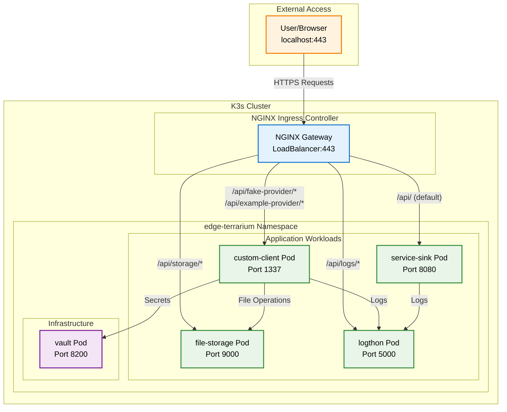
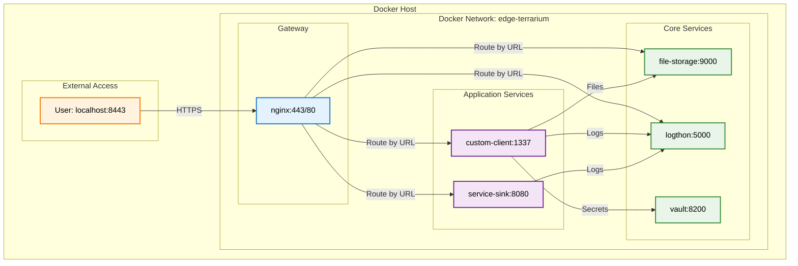
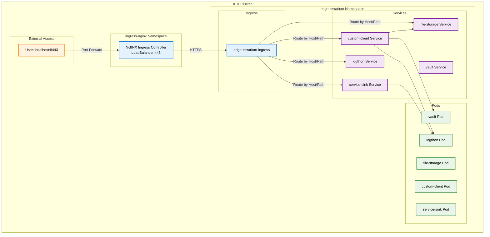
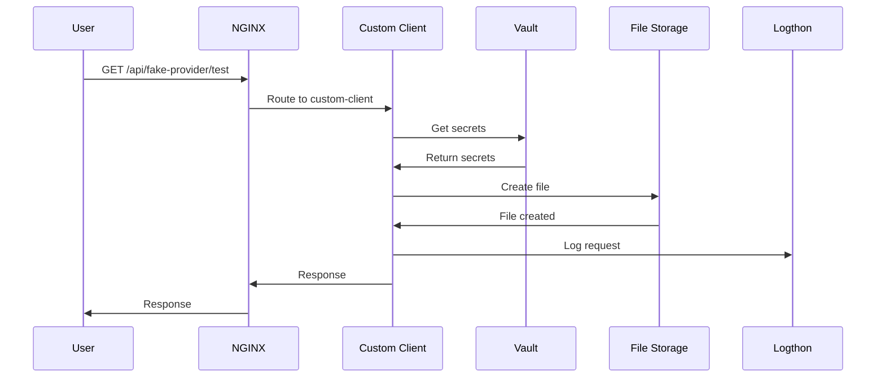
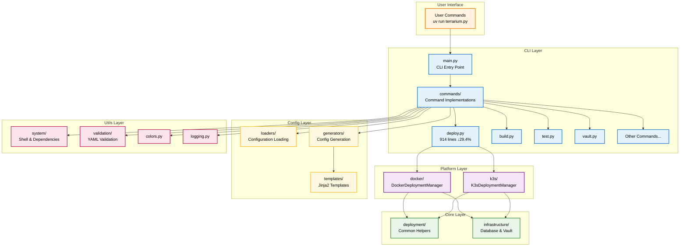
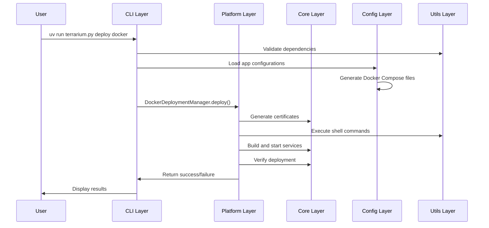

# Architecture Overview

Edge-Terrarium is designed as a modern microservices platform that demonstrates containerization and orchestration best practices.

## System Architecture

### High-Level Architecture



## Component Overview

### Core Services

#### Custom Client (C Application)
- **Purpose**: Handles special API routes and demonstrates C application containerization
- **Port**: 1337
- **Routes**: `/api/fake-provider/*`, `/api/example-provider/*`
- **Features**:
  - Vault integration for secrets management
  - File creation via File Storage API
  - Request logging to Logthon
  - Health check endpoints

#### Service Sink (C Application)
- **Purpose**: Default route handler for unmatched requests
- **Port**: 8080
- **Routes**: `/api/` (catch-all)
- **Features**:
  - Handles all unmatched API requests
  - Request logging to Logthon
  - Health check endpoints

#### File Storage (Python FastAPI)
- **Purpose**: File management and storage operations
- **Port**: 9000
- **Routes**: `/api/storage/*`
- **Features**:
  - CRUD operations for files
  - Automatic file rotation
  - Integration with Logthon for logging
  - RESTful API design

#### Logthon (Python FastAPI)
- **Purpose**: Log aggregation and web UI
- **Port**: 5000
- **Routes**: `/api/logs/*`
- **Features**:
  - Centralized logging from all services
  - Web UI for log browsing
  - File storage viewer
  - Real-time log monitoring

### Infrastructure Services

#### Vault (HashiCorp Vault)
- **Purpose**: Secrets management and secure storage
- **Port**: 8200
- **Features**:
  - KV secrets engine
  - TLS certificate storage
  - Application secret management
  - RESTful API for secret access

#### NGINX (API Gateway)
- **Purpose**: Request routing and load balancing
- **Port**: 443 (HTTPS), 80 (HTTP)
- **Features**:
  - API gateway functionality
  - SSL/TLS termination
  - Request routing based on URL patterns
  - CORS support
  - Health check routing

## Deployment Architectures

### Docker Compose Architecture



### K3s Architecture



## Request Flow

### External Request Processing

1. **User Request**: Browser sends HTTPS request to `localhost:8443`
2. **Gateway Routing**: NGINX receives request and routes based on URL pattern
3. **Service Processing**: Target service processes the request
4. **Internal Communication**: Service may communicate with other services
5. **Response**: Service returns response through NGINX to user

### Internal Service Communication



## Security Architecture

### Network Security

- **Internal Communication**: Services communicate over internal networks
- **TLS Termination**: NGINX handles SSL/TLS encryption
- **Namespace Isolation**: K3s namespaces provide logical separation
- **Service Mesh**: Internal traffic is encrypted and authenticated

### Secrets Management

- **Centralized Storage**: All secrets stored in Vault
- **Encrypted at Rest**: Secrets encrypted using Vault's encryption
- **Access Control**: Token-based authentication
- **No Hardcoded Secrets**: Applications retrieve secrets at runtime

## Scalability Considerations

### Horizontal Scaling

- **Stateless Services**: All services designed to be stateless
- **Load Balancing**: NGINX distributes traffic across instances
- **Service Discovery**: Kubernetes provides automatic service discovery
- **Health Checks**: Automatic health monitoring and failover

### Resource Management

- **Resource Limits**: CPU and memory limits defined for each service
- **Resource Requests**: Minimum resources guaranteed for each service
- **Auto-scaling**: Services can be scaled based on demand
- **Resource Monitoring**: Built-in monitoring and alerting

## Monitoring and Observability

### Logging

- **Centralized Logging**: All services send logs to Logthon
- **Structured Logging**: JSON-formatted logs for easy parsing
- **Log Aggregation**: Real-time log collection and display
- **Log Retention**: Configurable log retention policies

### Health Monitoring

- **Health Endpoints**: Each service exposes health check endpoints
- **Liveness Probes**: Kubernetes monitors service health
- **Readiness Probes**: Ensures services are ready to receive traffic
- **Startup Probes**: Monitors service startup time

### Metrics and Alerting

- **Service Metrics**: Request counts, response times, error rates
- **Resource Metrics**: CPU, memory, and network usage
- **Custom Metrics**: Application-specific metrics
- **Alerting**: Configurable alerts for service issues

## Configuration Management

### Dynamic Configuration

- **Template-based**: Jinja2 templates for consistent configuration
- **Environment-specific**: Different configs for Docker vs K3s
- **Auto-generation**: Configurations generated from app definitions
- **Version Control**: All configurations tracked in Git

### Application Configuration

- **App-based**: Each application defines its own configuration
- **Dependency Management**: Automatic dependency resolution
- **Environment Variables**: Runtime configuration via environment variables
- **Secrets Integration**: Secure secret injection from Vault

## CLI Architecture (New Modular Design)

The Edge-Terrarium CLI has been completely redesigned with a modern, modular architecture that provides better separation of concerns and maintainability.

### CLI Architecture Overview



### Layer Responsibilities

#### 🎯 CLI Layer (`terrarium_cli/cli/`)
**Purpose**: User interface and command handling
- **Entry Point**: `main.py` - CLI argument parsing and command routing
- **Commands**: Individual command implementations with clear responsibilities
- **Optimization**: Main deploy.py reduced from 1,294 to 914 lines (29.4% reduction)

#### 🧠 Core Layer (`terrarium_cli/core/`)
**Purpose**: Core business logic and shared functionality
- **Deployment**: Common deployment helpers used by all platforms
- **Infrastructure**: Database, Vault, and infrastructure service utilities

#### 🚀 Platform Layer (`terrarium_cli/platforms/`)
**Purpose**: Platform-specific deployment implementations
- **Docker Manager**: Complete Docker Compose orchestration
- **K3s Manager**: Complete Kubernetes/K3s orchestration
- **Isolation**: Platform-specific logic cleanly separated

#### ⚙️ Config Layer (`terrarium_cli/config/`)
**Purpose**: Configuration management and generation
- **Loaders**: Application configuration parsing and loading
- **Generators**: Dynamic configuration file generation
- **Templates**: Jinja2 templates for all generated configurations

#### 🔧 Utils Layer (`terrarium_cli/utils/`)
**Purpose**: Shared utilities and helpers
- **System**: Shell command execution and dependency checking
- **Validation**: YAML configuration validation
- **Common**: Colors, logging, and other shared utilities

### Key Architectural Benefits

#### **Separation of Concerns**
Each layer has a single, well-defined responsibility:
- CLI handles user interaction
- Core provides business logic
- Platform handles deployment specifics
- Config manages configuration
- Utils provides shared functionality

#### **Platform Abstraction**
Deployment logic is cleanly separated by platform:
```python
# Docker deployment
docker_manager = DockerDeploymentManager()
docker_manager.deploy(dependencies, cleanup_k3s)

# K3s deployment  
k3s_manager = K3sDeploymentManager()
k3s_manager.deploy(dependencies, cleanup_docker, certificates, images)
```

#### **Modular Import Structure**
Clear, logical import paths:
```python
# CLI commands
from terrarium_cli.cli.commands.deploy import DeployCommand

# Platform managers
from terrarium_cli.platforms.docker.docker_manager import DockerDeploymentManager
from terrarium_cli.platforms.k3s.k3s_manager import K3sDeploymentManager

# Core functionality
from terrarium_cli.core.deployment.common import CommonDeploymentHelpers

# Configuration management
from terrarium_cli.config.loaders.app_loader import AppLoader
from terrarium_cli.config.generators.generator import ConfigGenerator

# System utilities
from terrarium_cli.utils.system.shell import run_command
from terrarium_cli.utils.validation.yaml_validator import validate_all_app_configs
```

#### **Extensibility**
The modular design makes it easy to:
- Add new deployment platforms (e.g., `platforms/aws/`, `platforms/gcp/`)
- Add new commands (e.g., `cli/commands/monitor.py`)
- Add new configuration generators (e.g., `config/generators/helm_generator.py`)
- Add new utilities (e.g., `utils/monitoring/`)

#### **Maintainability**
- **29.4% code reduction** in main deployment file
- **Clear ownership**: Each module has a specific purpose
- **Reduced coupling**: Modules interact through well-defined interfaces
- **Easy testing**: Each layer can be tested independently

### Deployment Flow



This modular CLI architecture provides a solid foundation for managing complex deployment orchestration while maintaining clean separation of concerns and enabling easy extension and maintenance.

## Summary

This architecture provides a solid foundation for understanding modern microservices patterns, containerization, orchestration technologies, and clean software architecture principles.
