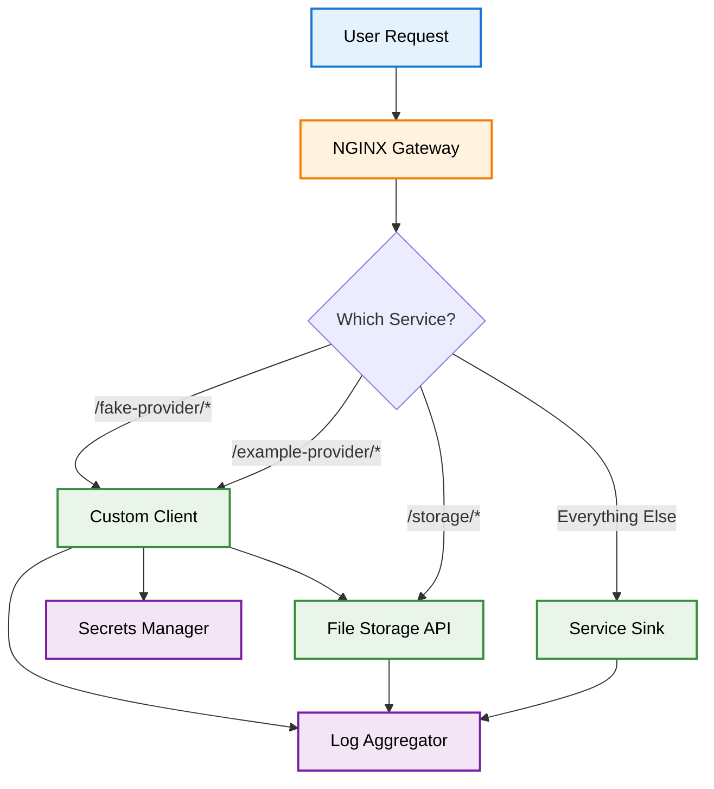
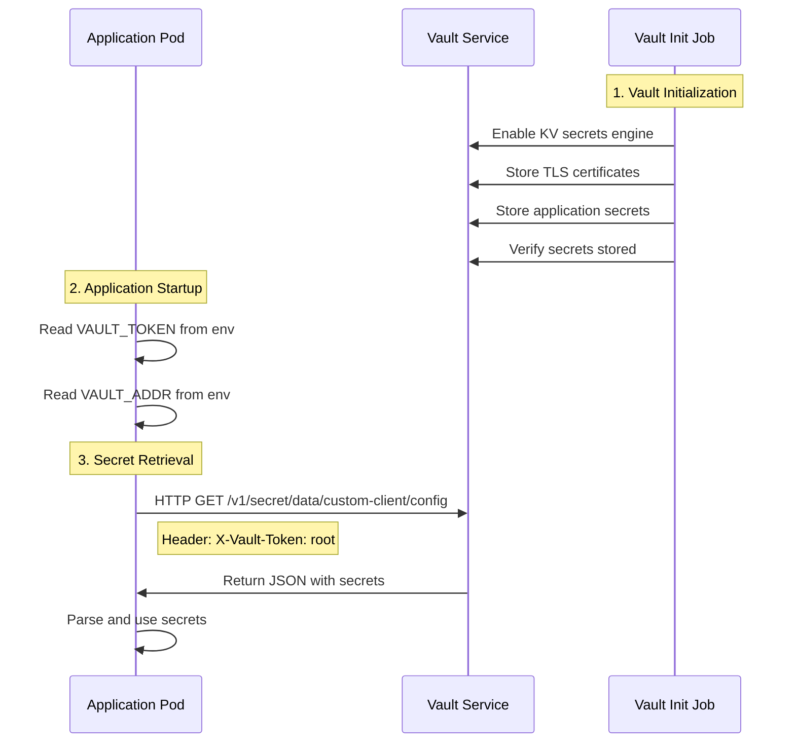

# Learning Path Guide

This guide provides a structured learning progression through Edge-Terrarium, from basic concepts to advanced features.

## Part 1: Understanding the Application

### What is Edge-Terrarium?

Edge-Terrarium is a **microservices application** that demonstrates how modern applications are built using containers. Think of it as a simplified version of what you'd see in production.

### The Application Components



### Component Definitions

- **NGINX Gateway**: API gateway that routes HTTP requests based on URL patterns
- **Custom Client**: C application that handles requests to `/fake-provider/*` and `/example-provider/*` paths, and automatically creates files via the File Storage API
- **Service Sink**: C application that handles all other HTTP requests as the default route
- **File Storage API**: Python FastAPI service that provides CRUD operations for file system storage with automatic file rotation
- **Log Aggregator**: Python service that collects and displays logs from all applications, including a web UI for viewing stored files
- **Secrets Manager**: HashiCorp Vault that securely stores and provides application secrets

### Why This Architecture?

1. **Scalability**: Each service can be scaled independently
2. **Reliability**: If one service fails, others keep working
3. **Maintainability**: Teams can work on different services
4. **Security**: Secrets are managed centrally and securely

## Part 2: Docker Basics

### What is Docker?

Docker is a containerization platform that packages applications and their dependencies into lightweight, portable containers. Containers provide process isolation and resource management while sharing the host operating system kernel.

### Key Docker Concepts

| Concept | Definition | Purpose |
|---------|------------|---------|
| **Container** | Runtime instance of a Docker image | Isolated process environment with application and dependencies |
| **Image** | Immutable template containing application code and dependencies | Blueprint for creating containers |
| **Dockerfile** | Text file with instructions for building Docker images | Defines how to construct the application environment |
| **Docker Compose** | Tool for defining and running multi-container applications | Orchestrates multiple containers with networking and volumes |

### Running Edge-Terrarium with Docker

#### Step 1: Build the Images
```bash
# This creates Docker images for each service
python3 terrarium.py build
```

**What happens**: The unified build script:
- Reads the Dockerfile in each service directory
- Creates runnable images with smart caching (only rebuilds if source files changed)
- Automatically detects your system architecture (AMD64/ARM64)
- Builds all core services: Custom Client, Service Sink, Logthon, and File Storage

#### Step 2: Start the Services
```bash
# This starts all services and connects them
python3 terrarium.py deploy docker
```

**What happens**: Docker Compose reads the configuration and:
- Starts 6 containers (custom-client, service-sink, logthon, file-storage, vault, nginx)
- Creates a network so they can talk to each other
- Sets up port mappings so you can access them

#### Step 3: Test the Application
```bash
# This sends test requests to verify everything works
python3 terrarium.py test
```

### Understanding Docker Compose

The Docker Compose configuration uses a hierarchical structure to organize services by their dependencies and startup order:

#### Service Startup Order

The services start in this specific sequence to ensure dependencies are available:

```
vault → vault-init → logthon → file-storage → (custom-client, service-sink) → nginx-gateway
```

**Why This Order Matters**:
- **Vault & vault-init**: Must be ready before any service can access secrets
- **logthon**: All other services send logs to logthon, so it must be ready first
- **file-storage**: Custom client immediately calls file-storage API after startup
- **custom-client & service-sink**: Can start in parallel once their dependencies are ready
- **nginx-gateway**: Routes external traffic, so it starts last after all services are healthy

## Part 3: K3s Introduction

### What is K3s?

K3s is a lightweight Kubernetes distribution designed for resource-constrained environments. It provides the core Kubernetes functionality with reduced complexity and resource requirements.

### K3s vs Kubernetes Differences

| Aspect | Kubernetes | K3s |
|--------|------------|-----|
| **Size** | ~1GB+ | ~50MB |
| **Components** | Multiple separate binaries | Single binary |
| **Storage** | etcd (default) | SQLite (default), supports etcd |
| **Networking** | CNI plugins required | Built-in Flannel |
| **Load Balancer** | External load balancer required | Built-in service load balancer |
| **Use Case** | Production clusters | Development, edge, IoT |

### Key K3s Concepts

| Concept | Docker Equivalent | Definition |
|---------|------------------|------------|
| **Pod** | Container | Smallest deployable unit containing one or more containers |
| **Deployment** | Docker Compose service | Manages replica sets and rolling updates |
| **Service** | Docker network | Provides stable network endpoint for pods |
| **Ingress** | NGINX Gateway | Routes external HTTP/HTTPS traffic to services |
| **Namespace** | Docker Compose project | Logical isolation boundary for resources |

### Running Edge-Terrarium with K3s

#### Step 1: Create a K3s Cluster
```bash
# This creates a local K3s cluster using k3d
python3 terrarium.py deploy k3s
```

**What happens**: 
- k3d creates a K3s cluster inside Docker containers
- This simulates a real K3s cluster on your local machine

#### Step 2: Deploy the Application
The script automatically:
- Builds Docker images
- Loads them into the K3s cluster
- Creates all the K3s resources (pods, services, ingress)

#### Step 3: Test the Application
```bash
# This tests the K3s deployment
python3 terrarium.py test
```

#### Step 4: Access the Kubernetes Dashboard
```bash
# The dashboard token is displayed during deployment
# Access the dashboard at: https://localhost:9443
# Use the bearer token from the deployment output
```

**Dashboard Features**:
- Monitor pod health and resource usage
- View application logs
- Scale deployments
- Manage services and ingress
- Access cluster configuration

### Understanding K3s Resources

#### Pods
```yaml
# A pod runs one or more containers
apiVersion: v1
kind: Pod
metadata:
  name: custom-client-pod
spec:
  containers:
  - name: custom-client
    image: edge-terrarium-custom-client:latest
    ports:
    - containerPort: 1337
```

#### Services
```yaml
# A service provides stable network access to pods
apiVersion: v1
kind: Service
metadata:
  name: custom-client-service
spec:
  selector:
    app: custom-client
  ports:
  - port: 1337
    targetPort: 1337
```

#### Ingress
```yaml
# An ingress routes external traffic to services
apiVersion: networking.k8s.io/v1
kind: Ingress
metadata:
  name: edge-terrarium-ingress
spec:
  rules:
  - host: localhost
    http:
      paths:
      - path: /fake-provider
        pathType: Prefix
        backend:
          service:
            name: custom-client-service
            port:
              number: 1337
```

## Part 4: Advanced Features

### Secrets Management with Vault

**Problem**: Applications need passwords, API keys, and certificates, but storing them in code is insecure.

**Solution**: HashiCorp Vault stores secrets securely and provides them to applications when needed.

#### How It Works
1. Vault stores secrets encrypted
2. Applications authenticate with Vault
3. Vault provides secrets to authenticated applications
4. Secrets are never stored in application code

#### Authentication Flow



**Key Steps:**
1. **Vault Initialization**: The vault-init job populates Vault with required secrets
2. **Application Startup**: Pods read authentication credentials from environment variables
3. **Secret Retrieval**: Applications make authenticated HTTP requests to Vault API
4. **Secret Usage**: Applications parse and use the retrieved secrets

### Log Aggregation and Monitoring

The platform includes comprehensive logging and monitoring capabilities:

- **Centralized Logging**: All services send logs to the logthon service
- **Web UI**: Browse logs and files through a web interface
- **File Storage Integration**: View and manage files created by applications
- **Real-time Monitoring**: Monitor service health and performance

### API Gateway and Routing

NGINX serves as the API gateway, providing:

- **Request Routing**: Routes requests based on URL patterns
- **Load Balancing**: Distributes traffic across service instances
- **SSL Termination**: Handles HTTPS encryption/decryption
- **CORS Support**: Enables cross-origin requests
- **Health Checks**: Monitors service availability

### Dynamic Configuration

The platform features a dynamic configuration system:

- **Template-based Generation**: Uses Jinja2 templates for consistent configuration
- **App-based Configuration**: Each application defines its own settings
- **Automatic Updates**: Configurations are regenerated when apps change
- **Environment-specific**: Different configs for Docker vs K3s

## Learning Progression

1. **Start with Docker** - Get familiar with containers and basic orchestration
2. **Explore K3s** - Learn Kubernetes concepts with a lightweight distribution
3. **Understand Architecture** - Study how microservices communicate
4. **Master Advanced Features** - Dive into secrets management, monitoring, and configuration

## Next Steps

After completing the learning path:

1. **Experiment** - Try modifying services and configurations
2. **Add Services** - Use the `add-app` command to create new applications
3. **Scale Services** - Learn about horizontal scaling in K3s
4. **Monitor Performance** - Use the built-in monitoring tools
5. **Deploy to Production** - Apply these concepts to real-world deployments
