# Project Structure

This document explains the organization and structure of the Edge-Terrarium project, including the recent architectural improvements that provide better separation of concerns and maintainability.

## Directory Overview

```mermaid
%%{init: {'themeVariables': {'darkMode': true}}}%%
flowchart TD
    ROOT[edge-terrarium/]
    
    subgraph "Application Services"
        CC[custom-client/]
        SS[service-sink/]
        FS[file-storage/]
        LT[logthon/]
        V[vault/]
        N[nginx/]
    end
    
    subgraph "Configuration"
        CONFIG[configs/]
        DOCKER[configs/docker/]
        K3S[configs/k3s/]
        NGINX_CONF[configs/docker/nginx/]
    end
    
    subgraph "CLI Architecture (New)"
        CLI[terrarium_cli/]
        CLI_LAYER[cli/]
        CORE_LAYER[core/]
        PLATFORMS_LAYER[platforms/]
        CONFIG_LAYER[config/]
        UTILS_LAYER[utils/]
    end
    
    subgraph "Security"
        CERTS[certs/]
        VAULT_SECRETS[configs/vault-secrets.yml]
    end
    
    ROOT --> CC
    ROOT --> SS
    ROOT --> FS
    ROOT --> LT
    ROOT --> V
    ROOT --> N
    ROOT --> CONFIG
    ROOT --> CLI
    ROOT --> CERTS
    ROOT --> VAULT_SECRETS
    
    CONFIG --> DOCKER
    CONFIG --> K3S
    DOCKER --> NGINX_CONF
    
    CLI --> CLI_LAYER
    CLI --> CORE_LAYER
    CLI --> PLATFORMS_LAYER
    CLI --> CONFIG_LAYER
    CLI --> UTILS_LAYER
    
    classDef app fill:#e8f5e8,stroke:#388e3c,stroke-width:2px,color:#000
    classDef config fill:#e3f2fd,stroke:#1976d2,stroke-width:2px,color:#000
    classDef cli fill:#fff3e0,stroke:#f57c00,stroke-width:2px,color:#000
    classDef security fill:#f3e5f5,stroke:#7b1fa2,stroke-width:2px,color:#000
    classDef root fill:#fce4ec,stroke:#c2185b,stroke-width:3px,color:#000
    
    class CC,SS,FS,LT,V,N app
    class CONFIG,DOCKER,K3S,NGINX_CONF config
    class CLI,CLI_LAYER,CORE_LAYER,PLATFORMS_LAYER,CONFIG_LAYER,UTILS_LAYER cli
    class CERTS,VAULT_SECRETS security
    class ROOT root
```



## New CLI Architecture (Major Improvement)

The CLI has been completely reorganized into a clean, modular architecture that provides better separation of concerns and maintainability:

### 🎯 CLI Layer (`terrarium_cli/cli/`)
**Purpose**: User interface and command handling
```
cli/
├── commands/          # All CLI command implementations
│   ├── base.py       # Base command class
│   ├── deploy.py     # Main deployment orchestrator (914 lines, reduced from 1,294)
│   ├── build.py      # Build command
│   ├── test.py       # Test command
│   ├── add_app.py    # Add application command
│   ├── vault.py      # Vault management command
│   ├── cert.py       # Certificate management command
│   ├── check_deps.py # Dependency checking command
│   └── validate.py   # Configuration validation command
└── main.py           # CLI entry point
```

### 🧠 Core Layer (`terrarium_cli/core/`)
**Purpose**: Core business logic and shared functionality
```
core/
├── deployment/       # Common deployment helpers
│   └── common.py    # Shared deployment functionality
└── infrastructure/  # Infrastructure services
    └── database.py  # Database and Vault integration utilities
```

### 🚀 Platforms Layer (`terrarium_cli/platforms/`)
**Purpose**: Platform-specific deployment implementations
```
platforms/
├── docker/          # Docker-specific deployment logic
│   └── docker_manager.py  # Complete Docker deployment orchestration
└── k3s/             # K3s-specific deployment logic
    └── k3s_manager.py     # Complete K3s deployment orchestration
```

### ⚙️ Config Layer (`terrarium_cli/config/`)
**Purpose**: Configuration management and generation
```
config/
├── loaders/         # Configuration loaders
│   └── app_loader.py  # Application configuration loader
├── generators/      # Configuration generators
│   ├── generator.py     # Main configuration generator
│   └── nginx_generator.py  # NGINX-specific configuration generator
├── templates/       # Jinja2 templates (moved from root)
│   ├── add_app/     # Application scaffolding templates
│   ├── docker-compose.yml.j2
│   ├── k3s-*.yaml.j2  # Kubernetes manifest templates
│   └── ...
└── global_config.py # Global configuration management
```

### 🔧 Utils Layer (`terrarium_cli/utils/`)
**Purpose**: Shared utilities and helpers
```
utils/
├── system/          # System-level utilities
│   ├── shell.py     # Shell command execution
│   └── dependencies.py  # System dependency checking
├── validation/      # Validation utilities
│   └── yaml_validator.py  # YAML configuration validation
├── colors.py        # Terminal color output
└── logging.py       # Logging configuration
```

## Detailed Directory Structure

```
edge-terrarium/
├── apps/                      # Application services directory
│   ├── custom-client/         # C application for special requests
│   │   ├── src/               # Source code directory
│   │   │   ├── main.c         # Main application entry point
│   │   │   ├── common.h       # Common definitions
│   │   │   ├── http_server.c  # HTTP server implementation
│   │   │   ├── http_server.h  # HTTP server headers
│   │   │   ├── log_capture.c  # Log capture functionality
│   │   │   ├── log_capture.h  # Log capture headers
│   │   │   ├── logging.c      # Logging utilities
│   │   │   ├── logging.h      # Logging headers
│   │   │   ├── vault.c        # Vault integration
│   │   │   ├── vault.h        # Vault headers
│   │   │   ├── file_storage.c # File storage integration
│   │   │   └── file_storage.h # File storage headers
│   │   ├── Dockerfile         # Container build instructions
│   │   └── app-config.yml     # Application configuration
│   ├── service-sink/          # C application for default requests
│   │   ├── src/               # Source code directory
│   │   │   ├── main.c         # Main application entry point
│   │   │   ├── common.h       # Common definitions
│   │   │   ├── http_server.c  # HTTP server implementation
│   │   │   ├── http_server.h  # HTTP server headers
│   │   │   ├── log_capture.c  # Log capture functionality
│   │   │   ├── log_capture.h  # Log capture headers
│   │   │   ├── logging.c      # Logging utilities
│   │   │   └── logging.h      # Logging headers
│   │   ├── Dockerfile         # Container build instructions
│   │   └── app-config.yml     # Application configuration
│   ├── file-storage/          # Python file storage API service
│   │   ├── main.py            # FastAPI application entry point
│   │   ├── file_storage/      # Python package
│   │   │   ├── __init__.py
│   │   │   ├── api.py         # API endpoints
│   │   │   ├── app.py         # FastAPI app
│   │   │   ├── config.py      # Configuration
│   │   │   ├── logging.py     # Logging setup
│   │   │   ├── models.py      # Data models
│   │   │   └── storage.py     # File storage logic
│   │   ├── Dockerfile         # Container build instructions
│   │   ├── pyproject.toml     # Python dependencies
│   │   ├── README.md          # Service documentation
│   │   └── app-config.yml     # Application configuration
│   ├── logthon/               # Python log aggregation service
│   │   ├── main.py            # FastAPI application entry point
│   │   ├── logthon/           # Python package
│   │   │   ├── __init__.py
│   │   │   ├── api.py         # API endpoints
│   │   │   ├── app.py         # FastAPI app
│   │   │   ├── config.py      # Configuration
│   │   │   ├── logging.py     # Logging setup
│   │   │   ├── models.py      # Data models
│   │   │   ├── storage.py     # Log storage logic
│   │   │   ├── ui.py          # Web UI components
│   │   │   └── websocket_manager.py # WebSocket handling
│   │   ├── Dockerfile         # Container build instructions
│   │   ├── pyproject.toml     # Python dependencies
│   │   ├── README.md          # Service documentation
│   │   └── app-config.yml     # Application configuration
│   ├── vault/                 # Vault configuration
│   │   ├── Dockerfile         # Container build instructions
│   │   └── app-config.yml     # Application configuration
│   └── nginx/                 # NGINX gateway configuration
│       ├── Dockerfile         # Container build instructions
│       ├── nginx.conf         # NGINX configuration
│       ├── nginx.conf.template # NGINX template
│       ├── default.conf       # Default server configuration
│       ├── default.conf.template # Default server template
│       ├── server.conf.template # Server configuration template
│       ├── k3s-configmap-nginx.yaml.template # K3s ConfigMap template
│       └── app-config.yml     # Application configuration
├── configs/                   # Configuration files directory
│   ├── docker/                # Docker Compose configurations
│   │   ├── docker-compose.yml # Main Docker Compose file
│   │   ├── docker-compose.base.yml # Base services
│   │   ├── docker-compose.core.yml # Core services
│   │   ├── docker-compose.apps.yml # Application services
│   │   ├── docker-compose.gateway.yml # Gateway services
│   │   └── nginx/             # NGINX configurations
│   │       ├── nginx.conf     # Generated NGINX config
│   │       └── server.conf    # Generated server config
│   ├── k3s/                   # Kubernetes configurations
│   │   ├── namespace.yaml     # Namespace definition
│   │   ├── ingress.yaml       # Ingress configuration
│   │   ├── kustomization.yaml # Kustomize configuration
│   │   ├── nginx-configmap.yaml # NGINX ConfigMap
│   │   ├── nginx-ingress-controller.yaml # NGINX Ingress Controller (local template)
│   │   ├── vault-deployment.yaml # Vault deployment
│   │   ├── vault-service.yaml # Vault service
│   │   ├── vault-pvc.yaml     # Vault persistent volume claim
│   │   ├── custom-client-deployment.yaml # Custom client deployment
│   │   ├── custom-client-service.yaml # Custom client service
│   │   ├── service-sink-deployment.yaml # Service sink deployment
│   │   ├── service-sink-service.yaml # Service sink service
│   │   ├── file-storage-deployment.yaml # File storage deployment
│   │   ├── file-storage-service.yaml # File storage service
│   │   ├── file-storage-pvc.yaml # File storage persistent volume claim
│   │   ├── logthon-deployment.yaml # Logthon deployment
│   │   └── logthon-service.yaml # Logthon service
│   └── vault-secrets.yml      # Vault secrets configuration
├── terrarium_cli/             # CLI tool source code (NEW ARCHITECTURE)
│   ├── __init__.py
│   ├── cli/                   # 🎯 CLI interface layer
│   │   ├── __init__.py
│   │   ├── main.py            # CLI entry point
│   │   └── commands/          # Command implementations
│   │       ├── __init__.py
│   │       ├── base.py        # Base command class
│   │       ├── deploy.py      # Deploy command (914 lines, optimized)
│   │       ├── build.py       # Build command
│   │       ├── test.py        # Test command
│   │       ├── add_app.py     # Add app command
│   │       ├── vault.py       # Vault command
│   │       ├── cert.py        # Certificate command
│   │       ├── check_deps.py  # Dependency check command
│   │       └── validate.py    # Validation command
│   ├── core/                  # 🧠 Core business logic
│   │   ├── __init__.py
│   │   ├── deployment/        # Common deployment helpers
│   │   │   ├── __init__.py
│   │   │   └── common.py      # Shared deployment functionality
│   │   └── infrastructure/    # Infrastructure services
│   │       ├── __init__.py
│   │       └── database.py    # Database/Vault integration utilities
│   ├── platforms/             # 🚀 Platform-specific implementations
│   │   ├── __init__.py
│   │   ├── docker/            # Docker deployment logic
│   │   │   ├── __init__.py
│   │   │   └── docker_manager.py # Complete Docker orchestration
│   │   └── k3s/               # K3s deployment logic
│   │       ├── __init__.py
│   │       └── k3s_manager.py # Complete K3s orchestration
│   ├── config/                # ⚙️ Configuration management
│   │   ├── __init__.py
│   │   ├── loaders/           # Configuration loaders
│   │   │   ├── __init__.py
│   │   │   └── app_loader.py  # Application configuration loader
│   │   ├── generators/        # Configuration generators
│   │   │   ├── __init__.py
│   │   │   ├── generator.py   # Main configuration generator
│   │   │   └── nginx_generator.py # NGINX configuration generator
│   │   ├── templates/         # Jinja2 templates
│   │   │   ├── __init__.py
│   │   │   ├── add_app/       # Add app templates
│   │   │   │   ├── app-config.yml.j2
│   │   │   │   ├── Dockerfile-python.j2
│   │   │   │   ├── Dockerfile.j2
│   │   │   │   ├── README-python.md.j2
│   │   │   │   ├── README.md.j2
│   │   │   │   └── templates.yml
│   │   │   ├── docker-compose.yml.j2
│   │   │   ├── k3s-configmap-nginx.yaml.j2
│   │   │   ├── k3s-deployment.yaml.j2
│   │   │   ├── k3s-ingress.yaml.j2
│   │   │   ├── k3s-nginx-ingress-controller.yaml.j2
│   │   │   ├── k3s-pvc.yaml.j2
│   │   │   └── k3s-service.yaml.j2
│   │   └── global_config.py   # Global configuration
│   └── utils/                 # 🔧 Shared utilities
│       ├── __init__.py
│       ├── system/            # System utilities
│       │   ├── __init__.py
│       │   ├── shell.py       # Shell command execution
│       │   └── dependencies.py # System dependency checking
│       ├── validation/        # Validation utilities
│       │   ├── __init__.py
│       │   └── yaml_validator.py # YAML validation
│       ├── colors.py          # Color output utilities
│       └── logging.py         # Logging utilities
├── docs/                      # Documentation directory
│   ├── getting-started.md     # Getting started guide
│   ├── learning-path.md       # Learning path guide
│   ├── architecture.md        # Architecture overview
│   ├── project-structure.md   # This file
│   ├── configuration.md       # Configuration guide
│   ├── service-communication.md # Service communication guide
│   ├── testing.md             # Testing guide
│   ├── troubleshooting.md     # Troubleshooting guide
│   └── development.md         # Development guide
├── certs/                     # TLS certificates directory
├── terrarium.py               # Main CLI entry point
├── pyproject.toml             # Python project configuration
├── uv.lock                    # uv lock file
├── README.md                  # Main project documentation
└── LICENSE                    # License file
```

## Key Architectural Improvements

### 1. **Modular CLI Architecture**
The CLI has been completely reorganized from a monolithic structure into clean, purpose-driven layers:

- **29.4% file size reduction**: Main deploy.py reduced from 1,294 to 914 lines
- **Clear separation of concerns**: Each layer has a specific responsibility
- **Platform abstraction**: Docker and K3s logic cleanly separated
- **Improved maintainability**: Easier to modify and extend

### 2. **Import Path Optimization**
All import paths have been updated to reflect the logical structure:

```python
# Old (confusing)
from terrarium_cli.commands.deploy import DeployCommand
from terrarium_cli.utils.shell import run_command
from terrarium_cli.config.app_loader import AppLoader

# New (clear and logical)
from terrarium_cli.cli.commands.deploy import DeployCommand
from terrarium_cli.utils.system.shell import run_command
from terrarium_cli.config.loaders.app_loader import AppLoader
```

### 3. **Platform-Specific Managers**
Deployment logic is now cleanly separated:

- **DockerDeploymentManager**: Handles all Docker Compose operations
- **K3sDeploymentManager**: Handles all K3s/Kubernetes operations
- **CommonDeploymentHelpers**: Shared functionality between platforms

### 4. **Template Organization**
All Jinja2 templates moved from root to logical location:
- `terrarium_cli/templates/` → `terrarium_cli/config/templates/`
- Better organization alongside generators that use them

## Key Directories Explained

### `/apps/` - Application Services
Contains all the microservices that make up the platform:
- **custom-client**: C application handling special API routes
- **service-sink**: C application for default request handling
- **file-storage**: Python FastAPI service for file operations
- **logthon**: Python FastAPI service for log aggregation
- **vault**: Vault configuration and setup
- **nginx**: NGINX gateway configuration

Each service directory contains:
- Source code specific to that service
- `Dockerfile` for containerization
- `app-config.yml` for service configuration
- Service-specific documentation

### `/configs/` - Configuration Files
Contains all generated configuration files:
- **docker/**: Docker Compose configurations
- **k3s/**: Kubernetes YAML manifests
- **vault-secrets.yml**: Vault secrets configuration

### `/terrarium_cli/` - Modular CLI Tool
The completely reorganized Python CLI tool:

#### **CLI Layer** (`/cli/`)
- **Purpose**: User interface and command handling
- **Contains**: Command implementations and CLI entry point
- **Key File**: `deploy.py` - Main deployment orchestrator (29.4% smaller)

#### **Core Layer** (`/core/`)
- **Purpose**: Core business logic and shared functionality
- **Contains**: Common deployment helpers and infrastructure services
- **Key Files**: 
  - `deployment/common.py` - Shared deployment functionality
  - `infrastructure/database.py` - Database and Vault utilities

#### **Platforms Layer** (`/platforms/`)
- **Purpose**: Platform-specific deployment implementations
- **Contains**: Docker and K3s managers with complete orchestration logic
- **Key Files**:
  - `docker/docker_manager.py` - Complete Docker deployment orchestration
  - `k3s/k3s_manager.py` - Complete K3s deployment orchestration

#### **Config Layer** (`/config/`)
- **Purpose**: Configuration management and generation
- **Contains**: Loaders, generators, and templates
- **Key Files**:
  - `loaders/app_loader.py` - Application configuration loading
  - `generators/generator.py` - Main configuration generation
  - `templates/` - All Jinja2 templates (moved from root)

#### **Utils Layer** (`/utils/`)
- **Purpose**: Shared utilities and helpers
- **Contains**: System utilities and validation tools
- **Key Files**:
  - `system/shell.py` - Shell command execution
  - `system/dependencies.py` - System dependency checking
  - `validation/yaml_validator.py` - YAML validation

### `/docs/` - Documentation
Comprehensive documentation split by topic:
- Getting started guides
- Learning paths
- Architecture documentation
- Configuration guides
- Troubleshooting information

## File Naming Conventions

### Application Files
- `main.c` / `main.py`: Application entry points
- `Dockerfile`: Container build instructions
- `app-config.yml`: Service configuration
- `pyproject.toml`: Python project configuration

### Configuration Files
- `docker-compose.*.yml`: Docker Compose configurations
- `*-deployment.yaml`: Kubernetes deployment manifests
- `*-service.yaml`: Kubernetes service manifests
- `*-pvc.yaml`: Kubernetes persistent volume claim manifests
- `ingress.yaml`: Kubernetes ingress configuration

### Template Files
- `*.j2`: Jinja2 template files
- `*.template`: Template files for configuration generation

## Auto-Generated Files

The following files are automatically generated and should not be edited manually:
- All files in `/configs/docker/` and `/configs/k3s/`
- NGINX configuration files
- Docker Compose files
- Kubernetes manifests

These files include warning comments indicating they are auto-generated.

## Development Workflow

1. **Modify Application Code**: Edit files in `/apps/[service-name]/`
2. **Update Configuration**: Modify `app-config.yml` files
3. **Regenerate Configs**: Run `uv run terrarium.py deploy [environment]`
4. **Test Changes**: Run `uv run terrarium.py test`
5. **Deploy**: Configuration files are automatically regenerated

## Benefits of the New Structure

### 🎯 **Clear Purpose**
Each directory has a single, well-defined purpose that's immediately obvious.

### 🧠 **Logical Grouping**
Related functionality is grouped together, making it easy to find and modify components.

### 🚀 **Platform Separation**
Docker and K3s deployment logic are cleanly separated, making it easy to add new platforms.

### ⚙️ **Config Organization**
Configuration loaders, generators, and templates are properly organized together.

### 🔧 **Utility Structure**
System utilities and validation tools are clearly separated and easy to locate.

### 📈 **Future-Ready**
The modular structure supports easy addition of new platforms, commands, and features.

### 🔧 **Maintainability**
The 29.4% reduction in the main deploy file and clear separation of concerns makes the codebase much easier to maintain and extend. Additional improvements include:

- **Intelligent error handling**: Expected failures are suppressed with clean user messages
- **Console output optimization**: Technical error logs replaced with user-friendly information
- **Robust deployment flow**: Graceful handling of K3s PVC binding and container health checks
- **Path resolution fixes**: All import paths updated to work with the new modular structure

This structure provides a clear separation of concerns and makes the project easy to navigate, understand, and maintain while supporting future growth and enhancements.