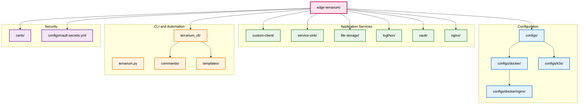

# Project Structure

This document explains the organization and structure of the Edge-Terrarium project.

## Directory Overview



## Detailed Directory Structure

```
edge-terrarium/
├── apps/                      # Application services directory
│   ├── custom-client/         # C application for special requests
│   │   ├── src/               # Source code directory
│   │   │   ├── main.c         # Main application entry point
│   │   │   ├── common.h       # Common definitions
│   │   │   ├── http_server.c  # HTTP server implementation
│   │   │   ├── http_server.h  # HTTP server headers
│   │   │   ├── log_capture.c  # Log capture functionality
│   │   │   ├── log_capture.h  # Log capture headers
│   │   │   ├── logging.c      # Logging utilities
│   │   │   ├── logging.h      # Logging headers
│   │   │   ├── vault.c        # Vault integration
│   │   │   ├── vault.h        # Vault headers
│   │   │   ├── file_storage.c # File storage integration
│   │   │   └── file_storage.h # File storage headers
│   │   ├── Dockerfile         # Container build instructions
│   │   └── app-config.yml     # Application configuration
│   ├── service-sink/          # C application for default requests
│   │   ├── src/               # Source code directory
│   │   │   ├── main.c         # Main application entry point
│   │   │   ├── common.h       # Common definitions
│   │   │   ├── http_server.c  # HTTP server implementation
│   │   │   ├── http_server.h  # HTTP server headers
│   │   │   ├── log_capture.c  # Log capture functionality
│   │   │   ├── log_capture.h  # Log capture headers
│   │   │   ├── logging.c      # Logging utilities
│   │   │   └── logging.h      # Logging headers
│   │   ├── Dockerfile         # Container build instructions
│   │   └── app-config.yml     # Application configuration
│   ├── file-storage/          # Python file storage API service
│   │   ├── main.py            # FastAPI application entry point
│   │   ├── file_storage/      # Python package
│   │   │   ├── __init__.py
│   │   │   ├── api.py         # API endpoints
│   │   │   ├── app.py         # FastAPI app
│   │   │   ├── config.py      # Configuration
│   │   │   ├── logging.py     # Logging setup
│   │   │   ├── models.py      # Data models
│   │   │   └── storage.py     # File storage logic
│   │   ├── Dockerfile         # Container build instructions
│   │   ├── pyproject.toml     # Python dependencies
│   │   ├── README.md          # Service documentation
│   │   └── app-config.yml     # Application configuration
│   ├── logthon/               # Python log aggregation service
│   │   ├── main.py            # FastAPI application entry point
│   │   ├── logthon/           # Python package
│   │   │   ├── __init__.py
│   │   │   ├── api.py         # API endpoints
│   │   │   ├── app.py         # FastAPI app
│   │   │   ├── config.py      # Configuration
│   │   │   ├── logging.py     # Logging setup
│   │   │   ├── models.py      # Data models
│   │   │   ├── storage.py     # Log storage logic
│   │   │   ├── ui.py          # Web UI components
│   │   │   └── websocket_manager.py # WebSocket handling
│   │   ├── Dockerfile         # Container build instructions
│   │   ├── pyproject.toml     # Python dependencies
│   │   ├── README.md          # Service documentation
│   │   └── app-config.yml     # Application configuration
│   ├── vault/                 # Vault configuration
│   │   ├── Dockerfile         # Container build instructions
│   │   └── app-config.yml     # Application configuration
│   └── nginx/                 # NGINX gateway configuration
│       ├── Dockerfile         # Container build instructions
│       ├── nginx.conf         # NGINX configuration
│       ├── nginx.conf.template # NGINX template
│       ├── default.conf       # Default server configuration
│       ├── default.conf.template # Default server template
│       ├── server.conf.template # Server configuration template
│       ├── k3s-configmap-nginx.yaml.template # K3s ConfigMap template
│       └── app-config.yml     # Application configuration
├── configs/                   # Configuration files directory
│   ├── docker/                # Docker Compose configurations
│   │   ├── docker-compose.yml # Main Docker Compose file
│   │   ├── docker-compose.base.yml # Base services
│   │   ├── docker-compose.core.yml # Core services
│   │   ├── docker-compose.apps.yml # Application services
│   │   ├── docker-compose.gateway.yml # Gateway services
│   │   └── nginx/             # NGINX configurations
│   │       ├── nginx.conf     # Generated NGINX config
│   │       └── server.conf    # Generated server config
│   ├── k3s/                   # Kubernetes configurations
│   │   ├── namespace.yaml     # Namespace definition
│   │   ├── ingress.yaml       # Ingress configuration
│   │   ├── kustomization.yaml # Kustomize configuration
│   │   ├── nginx-configmap.yaml # NGINX ConfigMap
│   │   ├── vault-deployment.yaml # Vault deployment
│   │   ├── vault-service.yaml # Vault service
│   │   ├── vault-pvc.yaml     # Vault persistent volume claim
│   │   ├── custom-client-deployment.yaml # Custom client deployment
│   │   ├── custom-client-service.yaml # Custom client service
│   │   ├── service-sink-deployment.yaml # Service sink deployment
│   │   ├── service-sink-service.yaml # Service sink service
│   │   ├── file-storage-deployment.yaml # File storage deployment
│   │   ├── file-storage-service.yaml # File storage service
│   │   ├── file-storage-pvc.yaml # File storage persistent volume claim
│   │   ├── logthon-deployment.yaml # Logthon deployment
│   │   └── logthon-service.yaml # Logthon service
│   └── vault-secrets.yml      # Vault secrets configuration
├── terrarium_cli/             # CLI tool source code
│   ├── __init__.py
│   ├── main.py                # CLI entry point
│   ├── commands/              # Command implementations
│   │   ├── __init__.py
│   │   ├── base.py            # Base command class
│   │   ├── build.py           # Build command
│   │   ├── check_deps.py      # Dependency check command
│   │   ├── deploy.py          # Deploy command
│   │   ├── test.py            # Test command
│   │   ├── vault.py           # Vault command
│   │   └── add_app.py         # Add app command
│   ├── config/                # Configuration management
│   │   ├── __init__.py
│   │   ├── app_loader.py      # Application configuration loader
│   │   ├── generator.py       # Configuration generator
│   │   ├── global_config.py   # Global configuration
│   │   └── nginx_generator.py # NGINX configuration generator
│   ├── templates/             # Jinja2 templates
│   │   ├── add_app/           # Add app templates
│   │   │   ├── app-config.yml.j2
│   │   │   ├── Dockerfile-python.j2
│   │   │   ├── Dockerfile.j2
│   │   │   ├── README-python.md.j2
│   │   │   ├── README.md.j2
│   │   │   └── templates.yml
│   │   ├── docker-compose.yml.j2
│   │   ├── k3s-configmap-nginx.yaml.j2
│   │   ├── k3s-deployment.yaml.j2
│   │   ├── k3s-ingress.yaml.j2
│   │   ├── k3s-pvc.yaml.j2
│   │   └── k3s-service.yaml.j2
│   └── utils/                 # Utility modules
│       ├── __init__.py
│       ├── colors.py          # Color output utilities
│       ├── dependencies.py    # Dependency checking
│       ├── logging.py         # Logging utilities
│       └── shell.py           # Shell command utilities
├── docs/                      # Documentation directory
│   ├── getting-started.md     # Getting started guide
│   ├── learning-path.md       # Learning path guide
│   ├── architecture.md        # Architecture overview
│   ├── project-structure.md   # This file
│   ├── configuration.md       # Configuration guide
│   ├── service-communication.md # Service communication guide
│   ├── testing.md             # Testing guide
│   ├── troubleshooting.md     # Troubleshooting guide
│   └── development.md         # Development guide
├── certs/                     # TLS certificates directory
├── terrarium.py               # Main CLI entry point
├── requirements.txt           # Python dependencies
├── README.md                  # Main project documentation
└── LICENSE                    # License file
```

## Key Directories Explained

### `/apps/` - Application Services
Contains all the microservices that make up the platform:
- **custom-client**: C application handling special API routes
- **service-sink**: C application for default request handling
- **file-storage**: Python FastAPI service for file operations
- **logthon**: Python FastAPI service for log aggregation
- **vault**: Vault configuration and setup
- **nginx**: NGINX gateway configuration

Each service directory contains:
- Source code specific to that service
- `Dockerfile` for containerization
- `app-config.yml` for service configuration
- Service-specific documentation

### `/configs/` - Configuration Files
Contains all generated configuration files:
- **docker/**: Docker Compose configurations
- **k3s/**: Kubernetes YAML manifests
- **vault-secrets.yml**: Vault secrets configuration

### `/terrarium_cli/` - CLI Tool
The Python CLI tool that manages the platform:
- **commands/**: Individual command implementations
- **config/**: Configuration management and generation
- **templates/**: Jinja2 templates for configuration generation
- **utils/**: Utility functions and helpers

### `/docs/` - Documentation
Comprehensive documentation split by topic:
- Getting started guides
- Learning paths
- Architecture documentation
- Configuration guides
- Troubleshooting information

## File Naming Conventions

### Application Files
- `main.c` / `main.py`: Application entry points
- `Dockerfile`: Container build instructions
- `app-config.yml`: Service configuration
- `pyproject.toml`: Python project configuration

### Configuration Files
- `docker-compose.*.yml`: Docker Compose configurations
- `*-deployment.yaml`: Kubernetes deployment manifests
- `*-service.yaml`: Kubernetes service manifests
- `*-pvc.yaml`: Kubernetes persistent volume claim manifests
- `ingress.yaml`: Kubernetes ingress configuration

### Template Files
- `*.j2`: Jinja2 template files
- `*.template`: Template files for configuration generation

## Auto-Generated Files

The following files are automatically generated and should not be edited manually:
- All files in `/configs/docker/` and `/configs/k3s/`
- NGINX configuration files
- Docker Compose files
- Kubernetes manifests

These files include warning comments indicating they are auto-generated.

## Development Workflow

1. **Modify Application Code**: Edit files in `/apps/[service-name]/`
2. **Update Configuration**: Modify `app-config.yml` files
3. **Regenerate Configs**: Run `python terrarium.py deploy [environment]`
4. **Test Changes**: Run `python terrarium.py test`
5. **Deploy**: Configuration files are automatically regenerated

This structure provides a clear separation of concerns and makes the project easy to navigate and maintain.
