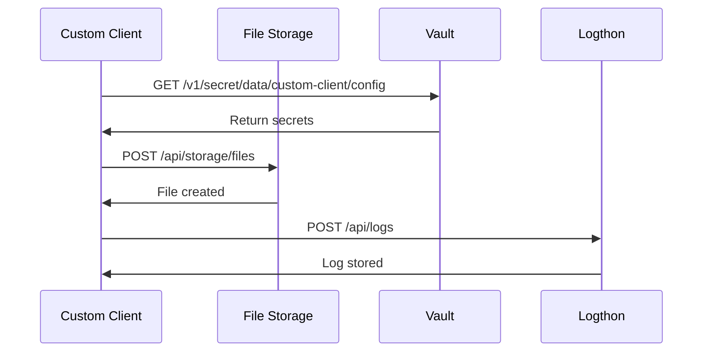
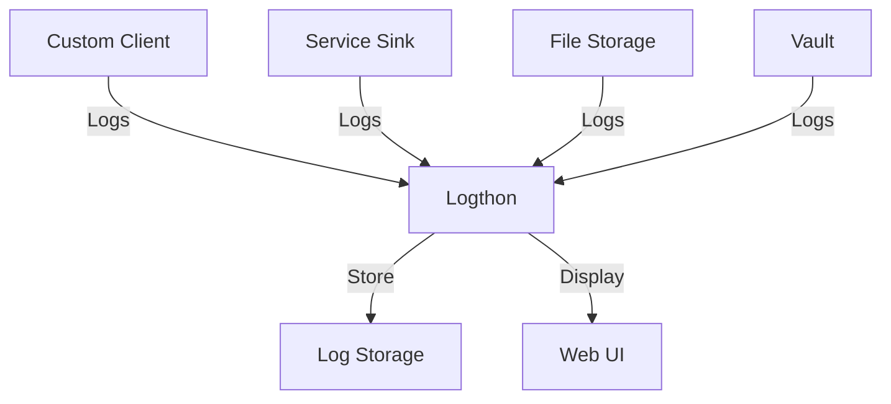

# Service Communication Guide

This guide explains how services communicate within the Edge-Terrarium platform.

## Communication Overview

Edge-Terrarium uses a microservices architecture where services communicate through:
- **HTTP APIs** for synchronous communication
- **Logging** for asynchronous communication
- **Vault** for secrets management
- **Service Discovery** for locating services

## Communication Patterns

### Synchronous Communication

Services communicate directly via HTTP APIs:



### Asynchronous Communication

Services send logs and events asynchronously:



## Service Discovery

### Docker Environment

Services discover each other using container names:

```yaml
# Service addresses in Docker
vault: "http://vault:8200"
logthon: "http://logthon:5000"
file-storage: "http://file-storage:9000"
```

### K3s Environment

Services discover each other using Kubernetes DNS:

```yaml
# Service addresses in K3s
vault: "http://vault-service.edge-terrarium.svc.cluster.local:8200"
logthon: "http://logthon-service.edge-terrarium.svc.cluster.local:5000"
file-storage: "http://file-storage-service.edge-terrarium.svc.cluster.local:9000"
```

## API Communication

### HTTP Client Implementation

Services use HTTP clients to communicate:

#### C Services
```c
// Example HTTP request in C
char* response = make_http_request("http://file-storage:9000/api/storage/files", 
                                  "POST", json_data, "application/json");
```

#### Python Services
```python
# Example HTTP request in Python
import requests

response = requests.post("http://file-storage:9000/api/storage/files", 
                        json=data, headers={"Content-Type": "application/json"})
```

### Request/Response Format

All API communication uses JSON:

```json
// Request
{
  "filename": "test.txt",
  "content": "Hello, World!",
  "metadata": {
    "author": "system",
    "timestamp": "2025-01-12T10:30:00Z"
  }
}

// Response
{
  "success": true,
  "file_id": "12345",
  "message": "File created successfully"
}
```

## Logging Communication

### Log Format

All services send structured logs to Logthon:

```json
{
  "timestamp": "2025-01-12T10:30:00Z",
  "level": "INFO",
  "service": "custom-client",
  "message": "Request processed successfully",
  "request_id": "req-12345",
  "metadata": {
    "endpoint": "/api/fake-provider/test",
    "method": "GET",
    "status_code": 200
  }
}
```

### Log Transmission

Services send logs via HTTP POST:

```bash
# Log transmission endpoint
POST http://logthon:5000/api/logs
Content-Type: application/json

{
  "level": "INFO",
  "message": "Service started",
  "service": "custom-client"
}
```

## Vault Integration

### Secret Retrieval

Services retrieve secrets from Vault:

```bash
# Vault API endpoint
GET http://vault:8200/v1/secret/data/custom-client/config
Headers:
  X-Vault-Token: root
```

### Secret Usage

Secrets are used for:
- Database connections
- API keys
- TLS certificates
- Configuration values

## Error Handling

### Communication Errors

Services handle communication errors gracefully:

```python
# Example error handling
try:
    response = requests.post(url, json=data, timeout=10)
    response.raise_for_status()
except requests.exceptions.RequestException as e:
    logger.error(f"Communication error: {e}")
    # Handle error appropriately
```

### Retry Logic

Services implement retry logic for transient failures:

```python
# Example retry logic
for attempt in range(max_retries):
    try:
        response = requests.post(url, json=data, timeout=10)
        if response.status_code == 200:
            break
    except requests.exceptions.RequestException:
        if attempt < max_retries - 1:
            time.sleep(retry_delay)
            continue
        else:
            raise
```

## Security Considerations

### Internal Communication

- Services communicate over internal networks
- No external access to internal services
- TLS encryption for sensitive data
- Authentication tokens for API access

### Secret Management

- Secrets stored in Vault
- No hardcoded credentials
- Token-based authentication
- Encrypted at rest and in transit

## Performance Optimization

### Connection Pooling

Services use connection pooling for efficiency:

```python
# Example connection pooling
import requests
from requests.adapters import HTTPAdapter
from urllib3.util.retry import Retry

session = requests.Session()
adapter = HTTPAdapter(
    pool_connections=10,
    pool_maxsize=20,
    max_retries=Retry(total=3, backoff_factor=0.1)
)
session.mount('http://', adapter)
session.mount('https://', adapter)
```

### Caching

Services implement caching where appropriate:

```python
# Example caching
import functools
import time

@functools.lru_cache(maxsize=128)
def get_secret(secret_path):
    # Retrieve secret from Vault
    pass
```

## Monitoring and Observability

### Health Checks

Services expose health check endpoints:

```bash
# Health check endpoint
GET http://service:port/health
Response: {"status": "healthy", "timestamp": "2025-01-12T10:30:00Z"}
```

### Metrics Collection

Services collect and report metrics:

```python
# Example metrics collection
import time

def track_request_duration(func):
    def wrapper(*args, **kwargs):
        start_time = time.time()
        result = func(*args, **kwargs)
        duration = time.time() - start_time
        logger.info(f"Request duration: {duration:.2f}s")
        return result
    return wrapper
```

## Troubleshooting Communication

### Common Issues

1. **Connection Refused**: Service not running or port not accessible
2. **Timeout Errors**: Service taking too long to respond
3. **DNS Resolution**: Service name not resolving
4. **Authentication Errors**: Invalid tokens or credentials
5. **Network Issues**: Firewall or network configuration problems

### Debug Commands

```bash
# Test service connectivity
curl -v http://service:port/health

# Check DNS resolution
nslookup service-name

# Test Vault connectivity
curl -H "X-Vault-Token: root" http://vault:8200/v1/sys/health

# Check service logs
docker logs service-name
kubectl logs -n edge-terrarium service-pod
```

### Network Debugging

```bash
# Check network connectivity
docker exec -it container ping service-name
kubectl exec -n edge-terrarium pod -- ping service-name

# Check port accessibility
telnet service-name port
kubectl port-forward -n edge-terrarium svc/service 8080:80
```

## Best Practices

### Communication Design

1. **Use HTTP APIs**: Standard REST APIs for service communication
2. **Implement Timeouts**: Set appropriate timeouts for all requests
3. **Handle Errors**: Implement proper error handling and retry logic
4. **Use Logging**: Log all important communication events
5. **Monitor Performance**: Track communication metrics and performance

### Security

1. **Validate Input**: Validate all incoming data
2. **Use HTTPS**: Encrypt sensitive communication
3. **Implement Authentication**: Use proper authentication mechanisms
4. **Limit Access**: Restrict service access to necessary endpoints
5. **Audit Logs**: Log all communication for security auditing

### Performance

1. **Connection Pooling**: Reuse connections for efficiency
2. **Caching**: Cache frequently accessed data
3. **Async Processing**: Use asynchronous processing where appropriate
4. **Load Balancing**: Distribute load across service instances
5. **Monitoring**: Monitor communication performance and bottlenecks

This service communication guide provides comprehensive information about how services interact within the Edge-Terrarium platform.
